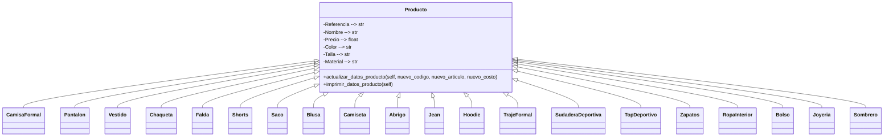
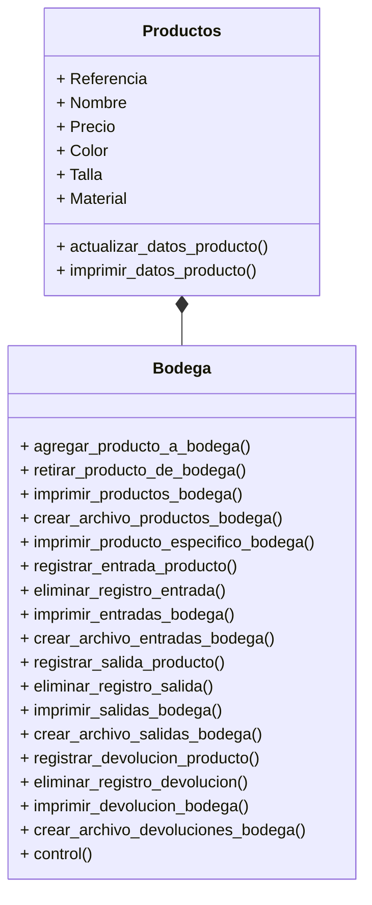

# NOTCLOTHES - Proyecto final POO
**Nombre del grupo:** );

**Integrantes:**
* Paula Jiménez Quiñones
* Jhon Alejandro Ramirez Diaz
* Sara Sofía Gómez Suárez

## Definición alternativa
### Alternativa 1
Construir una aplicación que emule un sistema de gestión de inventario para una bodega utilizando _Python_.

Condiciones:
+ Código original
+ Uso de herramientas vistas en el curso
+ Interacción y manejo a través de la consola
  
Operaciones:
+ Crear objeto a almacenar (+20 objetos, con distintos atributos)
+ Registro de entrada y salida
+ Método para obtener listado de inventario actual
+ Manejo de fechas en los registros
## Cómo se abordo el problema
### Sistema de gestión de inventario
En primer lugar, se hizo una investigación sobre el problema planteado. Este paso es muy importante para definir con claridad el problema y diseñar con mayor precisión los diagramas de clase.

Se investigó sobre lo que es una sistema de gestión de inventario y la forma en la que funciona. El entender este concepto del mundo real facilitó e hizo más eficiente el proceso de abstraer sus características principales, para luego representarlas gráficamente mediante clases, objetos y sus relaciones.


De acuerdo con Gabriel Baca (2014) en su libro _Introducción a la Ingenieria Industrial_, **el inventario** consiste en la acumulación de diversos artículos, materiales o productos que tienen valor y utilidad para una empresa. Estos materiales pueden ser utilizados como insumos (materias primas) para la producción de otros productos; también pueden ser productos intermedios (que están en proceso de transformación y serán trasladados a la siguiente etapa del proceso productivo), o productos terminados (que han completado el proceso productivo y están listos para ser enviados al cliente).

Sobre este contexto se entiende el **Sistema de Gestión de Inventario** como la acumulación y administración de artículos, materiales o productos que representan valor y utilidad para una empresa. El propósito de administrar el inventario de una empresa surge como forma de combatir la incertidumbre en la demanda y el suministro, asegurando que la empresa tenga los materiales necesarios para la producción y pueda satisfacer las necesidades de los clientes.

Por otro lado, el hecho de establecer un sistema de gestión de inventario implica algunos aspectos fundamentales como, el uso de **revisiones continuas**, reducción de niveles de inventario de seguridad, y métodos cuantitativos para equilibrar costos y niveles de servicio, asimismo formular un **conjunto de políticas y controles** que determinan las cantidades adecuadas de inventario, el tamaño de los pedidos y la frecuencia de compra y finalmente es importante mencionar que el hecho de mantener inventarios implica **riesgos** como obsolescencia, deterioro y costos de almacenamiento, de aqui la importancia de incluir costos de mantenimiento, pedidos y penalización.


### Empresa
En segundo lugar, se creó el escenario en el que se haría uso del sistema de gestión de inventario. Por lo tanto se ideó una empresa, se pensó en sus características principales y en el tipo de productos que vende.

Es así como creamos **NOTCLOTHES**.

En NotClothes, nos dedicamos a redefinir la alta costura y moda a través de un enfoque sostenible y centrado en el bienestar de nuestros clientes. Nuestro objetivo es crear prendas de diseño exclusivo y alta calidad en sus materiales que no solo realcen la belleza y la elegancia, sino que también promuevan la comodidad, las distintas perspectivas de género  y el respeto por el medio ambiente.

**MÉTRICAS** 

NOTCLOTHES, en su primer año de operaciones, generó ingresos por $4  millones USD, con un margen de beneficio bruto del 60% y una tasa de conversión del 3.5%. Con un valor promedio de pedido de $350 USD, ha capturado un 5% del mercado de alta costura sostenible en América Latina y mantiene una tasa de retención de clientes del 70%. **Su inventario rotativo** de 10,000 unidades tiene un ciclo de rotación de 90 días, y el coste de adquisición de clientes es de $50 USD. La tasa de devoluciones es del 5%, y cuenta con una comunidad activa de 500,000 seguidores en Instagram y 200,000 en TikTok. La base de clientes crece un 30% trimestre a trimestre, con un NPS de 85. Las ventas internacionales representan un 40% de los ingresos totales, NotClothes introduce 5 nuevos productos cada trimestre y ha reducido los costos operativos en un 20%. Las ventas online crecen un 40% año tras año, y participa en 10 eventos de moda anualmente. Su programa de fidelización tiene una participación del 50%, y ha reducido su huella de carbono en un 30% mediante el uso de materiales reciclados y procesos sostenibles.

### Productos
El tercer paso consistió en determinar cada uno de los productos que la empresa maneja y especificar sus atributos (nombre del producto, referencia, marca, precio, color, talla y material)

En la siguiente tabla se muestra el resultado de este paso.

||Producto|Ref.|Precio|Color|Talla|Material Principal|
|---|-----------------|------|---------|---------|--------|------|
|1|Shirt|20-01|$200 USD|Negro|XS-S-M-L-XL-XL|Algodon|
|2|Pants|20-02|$900 USD|Negro|XS-S-M-L-XL-XL|Algodon|
|3|Dress|20-03|$1200 USD|Negro|XS-S-M-L-XL-XL|Algodon|
|4|Jacket|20-04|$2200 USD|Negro|XS-S-M-L-XL-XL|Cuero|
|5|Skirt|20-05|$400 USD|Negro|XS-S-M-L-XL-XL|Algodon|
|6|Shorts|20-06|$100 USD|Negro|XS-S-M-L-XL-XL|Algodon|
|7|Sweater|20-07|$900 USD|Negro|XS-S-M-L-XL-XL|Algodon|
|8|Blouse|20-08|$400 USD|Negro|XS-S-M-L-XL-XL|Algodon|
|9|T-Shirt|20-09|$400 USD|Negro|XS-S-M-L-XL-XL|Algodon|
|10|Coat|20-10|$1200 USD|Negro|XS-S-M-L-XL-XL|Cuero|
|11|Jeans|20-11|$200 USD|Negro|XS-S-M-L-XL-XL|Algodon|
|12|Hoodie|20-12|$500 USD|Negro|XS-S-M-L-XL-XL|Algodon|
|13|Suit|20-13|$3200 USD|Negro|XS-S-M-L-XL-XL|Algodon|
|14|Tracksuit|20-14|$3200 USD|Negro|XS-S-M-L-XL-XL|Nylon|
|15|Sportswear|20-15|$200 USD|Negro|XS-S-M-L-XL-XL|Cuero|
|16|Footwear|20-16|$4200 USD|Negro|6-8|Poliéster|Cuero|
|15|Sportswear|20-15|$200 USD|Negro|XS-S-M-L-XL-XL|Algodon|
|17|Underwear|20-17|$100 USD|Negro|Unica|Poliéster|Algodon|
|18|Bag|20-18|$1000 USD|Negro|UNICA|Poliéster|Algodon|
|19|Jewelry|20-19|$3200 USD|Negro|UNICA|Poliéster|Plata|
|20|Hat|20-20|$1200 USD|Negro|UNICA|Poliéster|Cuero|

### Diagramas de clase
Habiendo entendido la forma en la que funciona un sistema de gestión de inventario y habiendo definido el uso específico que se le va a dar a este en el proyecto, el cuarto paso consistió en modelar, mediante diagramas de clase, las clases, los objetos y sus relaciones.

**Relación entre productos**

**Relación bodega-productos**


### Código
Para finalizar, teniendo en cuenta los diagramas de clase creados anteriormente, se realizó el código en python que emula el sistema de gestión de inventario para una bodega de la empresa creada.

**Estructura**

```
estructura_archivos/
├── paquete/
│   ├── __init__.py
│   ├── bodega.py
└── main.py
```

**bodega.py**
```
import json
class Producto():
    def __init__(self, codigo:str, articulo:str, costo:float):
        self.codigo=codigo
        self.articulo=articulo
        self.costo=costo

    def actualizar_datos_producto(self, nuevo_codigo:str, nuevo_articulo:str, nuevo_costo:float):
        self.codigo=nuevo_codigo
        self.articulo=nuevo_articulo
        self.costo=nuevo_costo
    
    def imprimir_datos_producto(self):
        producto = {"CODIGO":self.codigo, "ARTICULO":self.articulo, "COSTO":self.costo }
        for k,v in producto.items():
            print(k,v)

class Bodega():
    def __init__(self, *args):#meter como atributos a los productos que estan en la bodega
        self.productos={}
        self.entradas={}
        self.salidas={}
        self.devolucion={}
        for x in range(len(args)):
            self.productos[args[x].codigo]={"ARTICULO":args[x].articulo, "COSTO":args[x].costo,"ENTRADAS": 0, "SALIDAS": 0, "DEVOLUCION":0, "STOCK":0}
    
    def agregar_producto_a_bodega(self, producto:Producto):
        self.productos[producto.codigo]={"ARTICULO":producto.articulo, "COSTO":producto.costo,"ENTRADAS": 0, "SALIDAS": 0, "DEVOLUCION":0, "STOCK":0}
    
    def retirar_producto_de_bodega(self, producto:Producto):
        del self.productos[producto.codigo]

    def imprimir_productos_bodega(self):
        for k,v in self.productos.items():
            print(k,v)
    
    def crear_archivo_productos_bodega(self):
        data=self.productos
        writeFile = open("data_productos_bodega.json","w")
        json.dump(data, writeFile)
        writeFile.close()
        print("Archivo creado exitosamente.")

    def imprimir_producto_especifico_bodega(self, producto:Producto):
        if producto.codigo in self.productos:
            print(producto.codigo, (self.productos[producto.codigo]))
        else:
            print("El producto no existe en bodega.")

    def registrar_entrada_producto(self, codigo_producto_entrada: str, fecha_entrada:str, cantidad_producto_entrada:int):
        self.codigo=codigo_producto_entrada
        self.fecha=fecha_entrada
        self.cantidad=cantidad_producto_entrada
        if self.codigo in self.productos:
            longitud_diccionario=len(self.entradas)
            self.entradas[int(longitud_diccionario+1)]={"CODIGO":self.codigo, "ARTICULO":self.productos.get(self.codigo).get("ARTICULO"), "FECHA":self.fecha, "CANTIDAD":self.cantidad}
            self.productos[codigo_producto_entrada]["ENTRADAS"]+=int(self.cantidad)
            self.productos[codigo_producto_entrada]["STOCK"]+=int(self.cantidad)
        else:
            print("Código inexistente, la entrada del producto no se puede registrar.")
    
    def eliminar_registro_entrada(self,numero_de_registro:int):
        self.productos[self.entradas[numero_de_registro]["CODIGO"]]["ENTRADAS"]-=int(self.entradas.get(numero_de_registro).get("CANTIDAD"))
        self.productos[self.entradas[numero_de_registro]["CODIGO"]]["STOCK"]-=int(self.entradas.get(numero_de_registro).get("CANTIDAD"))
        del self.entradas[numero_de_registro]

    def imprimir_entradas_bodega(self):
        for k,v in self.entradas.items():
            print(k,v)

    def crear_archivo_entradas_bodega(self):
            data=self.entradas
            writeFile = open("data_entradas_bodega.json","w")
            json.dump(data, writeFile)
            writeFile.close()
            print("Archivo creado exitosamente.")

    def registrar_salida_producto(self, codigo_producto_salida: str, fecha_salida:str, cantidad_producto_salida:int):
        self.codigo=codigo_producto_salida
        self.fecha=fecha_salida
        self.cantidad=cantidad_producto_salida
        if self.codigo in self.productos:
            longitud_diccionario=len(self.salidas)
            self.salidas[int(longitud_diccionario+1)]={"CODIGO":self.codigo, "ARTICULO":self.productos.get(self.codigo).get("ARTICULO"), "FECHA":self.fecha, "CANTIDAD":self.cantidad}
            self.productos[codigo_producto_salida]["SALIDAS"]+=int(self.cantidad)
            self.productos[codigo_producto_salida]["STOCK"]-=int(self.cantidad)
        else:
            print("Código inexistente, la salida del producto no se puede registrar.")

    def eliminar_registro_salida(self,numero_de_registro:int):
        self.productos[self.salidas[numero_de_registro]["CODIGO"]]["SALIDAS"]+=int(self.salidas.get(numero_de_registro).get("CANTIDAD"))
        self.productos[self.salidas[numero_de_registro]["CODIGO"]]["STOCK"]+=int(self.salidas.get(numero_de_registro).get("CANTIDAD"))
        del self.salidas[numero_de_registro]

    def imprimir_salidas_bodega(self):
        for k, v in self.salidas.items():
            print(k,v)

    def crear_archivo_salidas_bodega(self):
            data=self.salidas
            writeFile = open("data_salidas_bodega.json","w")
            json.dump(data, writeFile)
            writeFile.close()
            print("Archivo creado exitosamente.")

    def registrar_devolucion_producto(self, codigo_producto_devolucion: str, fecha_devolucion:str, cantidad_producto_devolucion:int):
        self.codigo=codigo_producto_devolucion
        self.fecha=fecha_devolucion
        self.cantidad=cantidad_producto_devolucion
        if self.codigo in self.productos:
            longitud_diccionario=len(self.devolucion)
            self.devolucion[int(longitud_diccionario+1)]={"CODIGO":self.codigo, "ARTICULO":self.productos.get(self.codigo).get("ARTICULO"), "FECHA":self.fecha, "CANTIDAD":self.cantidad}
            self.productos[self.codigo]["DEVOLUCION"]+=int(self.cantidad)
            self.productos[self.codigo]["STOCK"]+=int(self.cantidad)
        else:
            print("Código inexistente, la devolucion del producto no se puede registrar.")
    
    def eliminar_registro_devolucion(self,numero_de_registro:int):
        self.productos[self.entradas[numero_de_registro]["CODIGO"]]["DEVOLUCION"]-=int(self.entradas.get(numero_de_registro).get("CANTIDAD"))
        self.productos[self.devolucion[numero_de_registro]["CODIGO"]]["STOCK"]-=int(self.devolucion.get(numero_de_registro).get("CANTIDAD"))
        del self.devolucion[numero_de_registro]

    def imprimir_devolucion_bodega(self):
        for k,v in self.devolucion.items():
            print(k,v)

    def crear_archivo_devoluciones_bodega(self):
            data=self.devolucion
            writeFile = open("data_devoluciones_bodega.json","w")
            json.dump(data, writeFile)
            writeFile.close()
            print("Archivo creado exitosamente.")

    def control(self):#Método para hacer conteo del inventario y confirmar que los datos del sistema sean iguales a los del conteo
        control_correcto={}
        control_incorrecto={}
        tipo_control=int(input("Usted va a realizar el control extracontable. Si el control es del todo el inventario ingrese el número 1, si es de solo un producto ingrese el número 2: "))
        if tipo_control==1:
            for x in self.productos:
                cantidad=int(input("Digite la cantidad de "+ str(x)+ " : "+str(self.productos.get(x).get("ARTICULO"))+" que hay en la bodega: "))
                if cantidad==int(self.productos.get(x).get("STOCK")):
                    control_correcto[x]={"ARTICULO":self.productos.get(x).get("ARTICULO"),"CANTIDAD":self.productos.get(x).get("STOCK")}
                    print("Los datos ingresados SÍ coinciden con los datos del sistema.")
                else:
                    control_incorrecto[x]={"ARTICULO":self.productos.get(x).get("ARTICULO"),"CANTIDAD BODEGA":self.productos.get(x).get("STOCK"), "CANTIDAD DEL CONTEO":cantidad}
                    print("Los datos ingresados NO coinciden con los datos del sistema. ")
            if len(control_correcto)>0:
                print("Los productos en los que SÍ coincide la cantidad en el sistema y en el conteo son: ")
                for k, v in control_correcto.items():
                    print(k,v)
            if len(control_incorrecto)>0:
                print("Los productos en los que NO coincide la cantidad en el sistema y en el conteo son: ")
                for k,v in control_incorrecto.items():
                    print(k,v)
        elif tipo_control==2:
            producto_control=str(input("Ingrese el código del producto del cual desea hacer el control: "))
            if producto_control in self.productos:
                cantidad=int(input("Digite la cantidad de "+ producto_control + " : "+str(self.productos.get(producto_control).get("ARTICULO"))+" que hay en la bodega: "))
                if cantidad==int(self.productos.get(producto_control).get("STOCK")):
                    print("Los datos ingresados SÍ coinciden con los datos del sistema.")
                else:
                    print("Los datos ingresados NO coinciden con los datos del sistema. ")
                    control_incorrecto[producto_control]={"ARTICULO":self.productos.get(producto_control).get("ARTICULO"),"CANTIDAD BODEGA":self.productos.get(producto_control).get("STOCK"), "CANTIDAD DEL CONTEO":cantidad}
                    for k,v in control_incorrecto.items():
                        print(k,v)
            else:
                print("El código ingresado no existe.")
        else:
            print("El número ingresado no es válido.")

        print("El control ha finalizado.")


```
**main.py**
```
import paquete.bodega as bodega

def main():
    shirt=bodega.Producto("20-01", "SHIRT", 200)
    pants=bodega.Producto("20-02", "PANTS", 900)
    dress=bodega.Producto("20-03", "DRESS", 1200)
    jacket=bodega.Producto("20-04", "JACKET", 2200)
    skirt=bodega.Producto("20-05", "SKIRT", 400)
    shorts=bodega.Producto("20-06", "SHORTS", 100)
    sweater=bodega.Producto("20-07", "SWEATER", 900)
    blouse=bodega.Producto("20-08", "BLOUSE", 400)
    tshirt=bodega.Producto("20-09", "T-SHIRT", 400)
    coat=bodega.Producto("20-10","COAT",1200)
    jeans=bodega.Producto("20-11", "JEANS", 200)
    hoodie=bodega.Producto("20-12", "HOODIE", 500)
    suit=bodega.Producto("20-13", "SUIT", 3200)
    tracksuit=bodega.Producto("20-14", "TRACKSUIR", 3200)
    sportswear=bodega.Producto("20-15", "SPORTSWEAR", 200)
    footwear=bodega.Producto("20-16","FOOTWEAR",4200)
    underwear=bodega.Producto("20-17", "UNDERWEAR", 100)
    bag=bodega.Producto("20-18", "BAG", 1000)
    jewelry=bodega.Producto("20-19", "JEWELRY", 3200)
    hat=bodega.Producto("20-20", "HAT", 1200)

    productos_en_bodega=bodega.Bodega(shirt, pants, dress, jacket, skirt)
    productos_en_bodega.registrar_entrada_producto("20-01", "28/08/2024", 1000)
    productos_en_bodega.registrar_salida_producto("20-01","28/08/2024",500)
    productos_en_bodega.imprimir_entradas_bodega()
    productos_en_bodega.imprimir_salidas_bodega()
    productos_en_bodega.imprimir_productos_bodega()
    productos_en_bodega.imprimir_producto_especifico_bodega(shirt)

if __name__=="__main__":
    main()
```
## Solución y la explicación
## Cómo instalar y usar el desarrollo
## Requerimientos para crear un entorno virtual
## Conclusiones
## Bibliografía
Baca Urbina, G., Cruz Valderrama, M., Cristóbal Vázquez, M. A., Baca Cruz, G., Gutiérrez Matus, J. C., Pacheco Espejel, A. A., Rivera González, Á. E., Rivera González, I. A., & Obregón Sánchez, M. G. (2014)Introducción a la Ingeniería Industrial (2ª ed.)1. Grupo Editorial Patria. ISBN 978-607-438-919-72.
