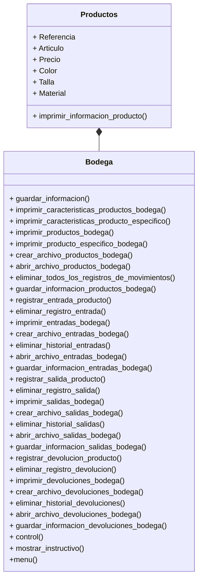

# NOTCLOTHES - Proyecto final POO
**Nombre del grupo:** );

**Integrantes:**
* Paula Jiménez Quiñones
* Jhon Alejandro Ramirez Diaz
* Sara Sofía Gómez Suárez

## Definición alternativa
### Alternativa 1
Construir una aplicación que emule un sistema de gestión de inventario para una bodega utilizando _Python_.

Condiciones:
+ Código original
+ Uso de herramientas vistas en el curso
+ Interacción y manejo a través de la consola
  
Operaciones:
+ Crear objeto a almacenar (+20 objetos, con distintos atributos)
+ Registro de entrada y salida
+ Método para obtener listado de inventario actual
+ Manejo de fechas en los registros
## Cómo se abordo el problema
### Sistema de gestión de inventario
En primer lugar, se hizo una investigación sobre el problema planteado. Este paso es muy importante para definir con claridad el problema y diseñar con mayor precisión los diagramas de clase.

Se investigó sobre lo que es una sistema de gestión de inventario y la forma en la que funciona. El entender este concepto del mundo real facilitó e hizo más eficiente el proceso de abstraer sus características principales, para luego representarlas gráficamente mediante clases, objetos y sus relaciones.


De acuerdo con Gabriel Baca (2014) en su libro _Introducción a la Ingenieria Industrial_, **el inventario** consiste en la acumulación de diversos artículos, materiales o productos que tienen valor y utilidad para una empresa. Estos materiales pueden ser utilizados como insumos (materias primas) para la producción de otros productos; también pueden ser productos intermedios (que están en proceso de transformación y serán trasladados a la siguiente etapa del proceso productivo), o productos terminados (que han completado el proceso productivo y están listos para ser enviados al cliente).

Sobre este contexto se entiende el **Sistema de Gestión de Inventario** como la acumulación y administración de artículos, materiales o productos que representan valor y utilidad para una empresa. El propósito de administrar el inventario de una empresa surge como forma de combatir la incertidumbre en la demanda y el suministro, asegurando que la empresa tenga los materiales necesarios para la producción y pueda satisfacer las necesidades de los clientes.

Por otro lado, el hecho de establecer un sistema de gestión de inventario implica algunos aspectos fundamentales como, el uso de **revisiones continuas**, reducción de niveles de inventario de seguridad, y métodos cuantitativos para equilibrar costos y niveles de servicio, asimismo formular un **conjunto de políticas y controles** que determinan las cantidades adecuadas de inventario, el tamaño de los pedidos y la frecuencia de compra y finalmente es importante mencionar que el hecho de mantener inventarios implica **riesgos** como obsolescencia, deterioro y costos de almacenamiento, de aqui la importancia de incluir costos de mantenimiento, pedidos y penalización.


### Empresa
En segundo lugar, se creó el escenario en el que se haría uso del sistema de gestión de inventario. Por lo tanto se ideó una empresa, se pensó en sus características principales y en el tipo de productos que vende.

Es así como creamos **NOTCLOTHES**.

En NotClothes, nos dedicamos a redefinir la alta costura y moda a través de un enfoque sostenible y centrado en el bienestar de nuestros clientes. Nuestro objetivo es crear prendas de diseño exclusivo y alta calidad en sus materiales que no solo realcen la belleza y la elegancia, sino que también promuevan la comodidad, las distintas perspectivas de género  y el respeto por el medio ambiente.

**MÉTRICAS** 

NOTCLOTHES, en su primer año de operaciones, generó ingresos por $4  millones USD, con un margen de beneficio bruto del 60% y una tasa de conversión del 3.5%. Con un valor promedio de pedido de $350 USD, ha capturado un 5% del mercado de alta costura sostenible en América Latina y mantiene una tasa de retención de clientes del 70%. **Su inventario rotativo** de 10,000 unidades tiene un ciclo de rotación de 90 días, y el coste de adquisición de clientes es de $50 USD. La tasa de devoluciones es del 5%, y cuenta con una comunidad activa de 500,000 seguidores en Instagram y 200,000 en TikTok. La base de clientes crece un 30% trimestre a trimestre, con un NPS de 85. Las ventas internacionales representan un 40% de los ingresos totales, NotClothes introduce 5 nuevos productos cada trimestre y ha reducido los costos operativos en un 20%. Las ventas online crecen un 40% año tras año, y participa en 10 eventos de moda anualmente. Su programa de fidelización tiene una participación del 50%, y ha reducido su huella de carbono en un 30% mediante el uso de materiales reciclados y procesos sostenibles.

### Productos
El tercer paso consistió en determinar cada uno de los productos que la empresa maneja y especificar sus atributos (nombre del producto, referencia, marca, precio, color, talla y material)

En la siguiente tabla se muestra el resultado de este paso.

||Producto|Ref.|Precio|Color|Talla|Material Principal|
|---|-----------------|------|---------|---------|--------|------|
|1|PanaShirt|20-01|$200 USD|Negro|unica|Seda|
|2|MilkShirt|20-02|$900 USD|Blanco|unica|Seda|
|3|SkyShirt|20-03|$1200 USD|Gris|unica|Seda|
|4|DirtyShirt|20-04|$2200 USD|Beige|unica|Seda|
|5|NoShirt|20-05|$400 USD|Transparente|unica|Plástico|
|6|CargoPants|19-01|$100 USD|Negro|unica|Algodon|
|7|NCPants|19-02|$900 USD|Negro|unica|Algodon|
|8|WIDEPants|19-03|$400 USD|Negro|unica|Algodon|
|9|XASSPants|19-04|$400 USD|Negro|unica|Algodon|
|10|DadPants|19-05|$1200 USD|Negro|unica|Cuero|
|11|SMGSHOES|18-01|$200 USD|Negro|unica|Cuero|
|12|HODSHOES|18-02|$500 USD|Negro|unica|Cuero|
|13|TRACKTORSHOES|18-03|$3200 USD|Negro|unica|Cuero|
|14|ADSHOES|18-04|$3200 USD|Negro|unica|Cuero|
|15|NOTSHOES|18-05|$13.000 USD|Negro|unica|Cuero|
|16|CandyNECKLACE|17-01|$200 USD|Blanco|unica|Plata|
|17|BulletsNECKLACE|18-02|$100 USD|Gris|unica|Titanio|
|18|NONECKLACE|18-03|$1000 USD|Plata|unica|Plata|
|19|MERCURYNECKLACE|18-04|$3200 USD|Negro|unica|Mercurio|
|20|SilverNecklace|18-05|$1200 USD|Plata|unica|Plata|

NOTCLOTHES maneja cuatro líneas de productos con cinco tipos de referencias diferentes entre sí. 

### Diagramas de clase
Habiendo entendido la forma en la que funciona un sistema de gestión de inventario y habiendo definido el uso específico que se le va a dar a este en el proyecto, el cuarto paso consistió en modelar, mediante diagramas de clase, las clases, los objetos y sus relaciones.

**Relación bodega-productos**


### Código
Para finalizar, teniendo en cuenta los diagramas de clase creados anteriormente, se realizó el código en python que emula el sistema de gestión de inventario para una bodega de la empresa creada.

**Estructura**

```
estructura_archivos/
├── paquete/
│   ├── __init__.py
│   ├── bodega.py
└── main.py
```

**bodega.py**
```

import json
import os.path

class Producto():
    def __init__(self, referencia:str, articulo:str, precio:float, color:str, talla: str, material:str):
        self.referencia=referencia
        self.articulo=articulo
        self.precio=precio
        self.color=color
        self.talla=talla
        self.material=material

    def imprimir_informacion_producto(self):
        informacion_producto = {"REFERENCIA":self.referencia, "ARTICULO":self.articulo, "PRECIO":self.precio, "COLOR":self.color, "TALLA":self.talla, "MATERIAL": self.material}
        print(informacion_producto)

class Bodega():
    def __init__(self, *args):#meter como atributos a los productos que estan en la bodega
        self.productos=self.abrir_archivo_productos_bodega()
        self.entradas=self.abrir_archivo_entradas_bodega()
        self.salidas=self.abrir_archivo_salidas_bodega()
        self.devoluciones=self.abrir_archivo_devoluciones_bodega()
        self.productos_en_bodega=[]
        for producto in args:
            self.productos_en_bodega.append(producto)
        for x in range(len(args)):
            self.productos[args[x].referencia]={"ARTICULO":args[x].articulo, "PRECIO":args[x].precio,"ENTRADAS": 0, "SALIDAS": 0, "DEVOLUCION":0, "STOCK":0}

    def guardar_informacion(self):
        self.guardar_informacion_devoluciones_bodega()
        self.guardar_informacion_entradas_bodega()
        self.guardar_informacion_productos_bodega()
        self.guardar_informacion_salidas_bodega()

    def imprimir_caracteristicas_productos_bodega(self):
        for producto in self.productos_en_bodega:
            producto.imprimir_informacion_producto()

    def imprimir_caracteristicas_producto_especifico(self):
        print("Estos son los productos que hay en bodega")
        for indice, producto in enumerate(self.productos_en_bodega):
            print(indice+1,":", producto.referencia,"-", producto.articulo)
        indice_seleccion_producto=int(input("Ingrese el número correspondiente al producto que desea conocer: "))
        if indice_seleccion_producto not in range (1,len(self.productos_en_bodega)+1):
            print("El número ingresado no corresponde a ningún producto.")
        else:
            producto=self.productos_en_bodega[indice_seleccion_producto-1]
            if producto.referencia in (self.productos):
                producto.imprimir_informacion_producto()
            else:
                print("No se puede imprimir la información del producto",producto.articulo,"porque no se encuentra registrado dentro del inventario de la bodega.")

    def imprimir_productos_bodega(self):
        if len(self.productos)>0:
            print("La información de todos los productos que hay en el inventario de la bodega y el resumen de sus movimientos son: ")
            for k,v in self.productos.items():
                print(k,v)
        else:
            print("No hay ningún producto registrado en el inventario de la bodega.")
    
    def imprimir_producto_especifico_bodega(self):
        print("Estos son los productos que hay en bodega")
        for indice, producto in enumerate(self.productos_en_bodega):
            print(indice+1,":", producto.referencia,"-", producto.articulo)
        indice_seleccion_producto=int(input("Ingrese el número correspondiente al producto que desea conocer: "))
        if indice_seleccion_producto not in range (1,len(self.productos_en_bodega)+1):
            print("El número ingresado no corresponde a ningún producto.")
        else:
            producto=self.productos_en_bodega[indice_seleccion_producto-1]
            if producto.referencia in self.productos:
                print("La información del producto",producto.articulo,"y el resumen de sus movimientos son: ")
                print(producto.referencia, (self.productos[producto.referencia]))
            else:
                print("No se puede imprimir la información del producto",producto.articulo,"porque no se encuentra registrado dentro del inventario de la bodega.")

    def crear_archivo_productos_bodega(self):
        data=self.productos
        writeFile = open("data_productos_bodega.json","w")
        json.dump(data, writeFile)
        writeFile.close()
        print("El archivo de los productos en bodega fue creado exitosamente.")
    
    def abrir_archivo_productos_bodega(self):
        if os.path.isfile("data_productos_bodega.json"):
            readFile = open("data_productos_bodega.json","r")
            self.data=json.load(readFile)
            readFile.close()
            return self.data
        else:
            return {}
    
    def eliminar_todos_los_registros_de_movimientos(self):
        confirmacion=int(input("Presione el número 1 si usted desea eliminar todos los registros del los movimientos realizados en bodega, si desea cancelar la solicitud presione enter: "))
        if confirmacion==1:
            self.eliminar_historial_devoluciones()
            self.eliminar_historial_entradas()
            self.eliminar_historial_salidas()
            print("Se han eliminado todos los registros de los movimientos con éxito.")
    
    def guardar_informacion_productos_bodega(self):
        data=self.productos
        writeFile = open("data_productos_bodega.json","w")
        json.dump(data, writeFile)
        writeFile.close()

    def registrar_entrada_producto(self):
        print("\nEstos son los productos que hay en bodega")
        for indice, producto in enumerate(self.productos_en_bodega):
            print(producto.referencia,":", producto.articulo)
        print("\nIngrese la información correspondiente a la entrada del producto:")
        referencia_producto_entrada=str(input("Ingrese la referencia del producto: "))
        fecha_entrada=str(input("Ingrese la fecha de entrada (DD/MM/AAAA): "))
        cantidad_producto_entrada=int(input("Ingrese la cantidad: "))
        if referencia_producto_entrada in self.productos:
            if len(self.entradas)>0:
                numero_ultimo_registro=int((max(self.entradas)))
            else:
                numero_ultimo_registro=0
            self.entradas[numero_ultimo_registro+1]={"REFERENCIA":referencia_producto_entrada, "ARTICULO":self.productos.get(referencia_producto_entrada).get("ARTICULO"), "FECHA":fecha_entrada, "CANTIDAD":cantidad_producto_entrada}
            self.productos[referencia_producto_entrada]["ENTRADAS"]+=int(cantidad_producto_entrada)
            self.productos[referencia_producto_entrada]["STOCK"]+=int(cantidad_producto_entrada)
            print("La entrada del producto",self.productos.get(referencia_producto_entrada).get("ARTICULO"),"fue registrada exitosamente.")
        else:
            print("La entrada del producto no se puede registrar porque la referencia ingresada no existe en el inventario de la bodega.")
    
    def eliminar_registro_entrada(self):
        numero_de_registro_entrada=int(input("Ingrese el número de registro de la entrada que desea eliminar: "))
        confirmacion=int(input("Presione el número 1 si usted desea eliminar el registro de la entrada número "+str(numero_de_registro_entrada)+"\nSi desea cancelar la solicitud de eliminar el registro de entrada presione enter."))
        if confirmacion==1:
            if numero_de_registro_entrada in self.entradas:
                self.productos[self.entradas[numero_de_registro_entrada]["REFERENCIA"]]["ENTRADAS"]-=int(self.entradas.get(numero_de_registro_entrada).get("CANTIDAD"))
                self.productos[self.entradas[numero_de_registro_entrada]["REFERENCIA"]]["STOCK"]-=int(self.entradas.get(numero_de_registro_entrada).get("CANTIDAD"))
                del self.entradas[numero_de_registro_entrada]
                print("La entrada con el número de registro ", numero_de_registro_entrada, "fue eliminada exitosamente.")
            else:
                print("No se puede eliminar la entrada con el número de registro", numero_de_registro_entrada, "porque no existe ese número de registro en el historial de entradas a la bodega.")

    def imprimir_entradas_bodega(self):
        if len(self.entradas)>0:
            print("El historial de todos los registros de las entradas a la bodega es: ")
            for k,v in self.entradas.items():
                print(k,v)
        else:
            print("Ninguna entrada a la bodega ha sido registrada.")

    def crear_archivo_entradas_bodega(self):
            data=self.entradas
            writeFile = open("data_entradas_bodega.json","w")
            json.dump(data, writeFile)
            writeFile.close()
            print("El archivo de las entradas a la bodega fue creado exitosamente.")
    
    def eliminar_historial_entradas(self):
        self.entradas={}

    def abrir_archivo_entradas_bodega(self):
        if os.path.isfile("data_entradas_bodega.json"):
            readFile = open("data_entradas_bodega.json","r")
            self.data=json.load(readFile)
            readFile.close()
            return self.data
        else:
            return {}
    
    def guardar_informacion_entradas_bodega(self):
        data=self.entradas
        writeFile = open("data_entradas_bodega.json","w")
        json.dump(data, writeFile)
        writeFile.close()

    def registrar_salida_producto(self):
        print("\nEstos son los productos que hay en bodega")
        for indice, producto in enumerate(self.productos_en_bodega):
            print(producto.referencia,":", producto.articulo)
        print("\nIngrese la información correspondiente a la salida del producto:")
        referencia_producto_salida=str(input("Ingrese la referencia del producto: "))
        fecha_salida=str(input("Ingrese la fecha de salida (DD/MM/AAAA): "))
        cantidad_producto_salida=int(input("Ingrese la cantidad: "))
        if referencia_producto_salida in self.productos:
            if cantidad_producto_salida<=self.productos.get(referencia_producto_salida).get("STOCK"):
                if len(self.salidas)>0:
                    numero_ultimo_registro=int(max(self.salidas))
                else:
                    numero_ultimo_registro=0
                self.salidas[int(numero_ultimo_registro+1)]={"REFERENCIA":referencia_producto_salida, "ARTICULO":self.productos.get(referencia_producto_salida).get("ARTICULO"), "FECHA":fecha_salida, "CANTIDAD":cantidad_producto_salida}
                self.productos[referencia_producto_salida]["SALIDAS"]+=int(cantidad_producto_salida)
                self.productos[referencia_producto_salida]["STOCK"]-=int(cantidad_producto_salida)
                print("La salida del producto",self.productos.get(referencia_producto_salida).get("ARTICULO"),"fue registrada exitosamente.")
            else:
                print("La salida del producto",self.productos.get(referencia_producto_salida).get("ARTICULO"),"no se puede registrar porque no hay suficientes unidades del producto en el stock.")
        else:
            print("La salida del producto no se puede registrar porque la referencia ingresada no existe en el inventario de la bodega.")

    def eliminar_registro_salida(self):
        numero_de_registro_salida=int(input("Ingrese el número de registro de la salida que desea eliminar: "))
        confirmacion=(input("Presione el número 1 si usted desea eliminar el registro de la salida número "+str(numero_de_registro_salida)+"\nSi desea cancelar la solicitud de eliminar el registro de salida presione enter."))
        if confirmacion==1:
            if numero_de_registro_salida in self.salidas:
                self.productos[self.salidas[numero_de_registro_salida]["REFERENCIA"]]["SALIDAS"]-=int(self.salidas.get(numero_de_registro_salida).get("CANTIDAD"))
                self.productos[self.salidas[numero_de_registro_salida]["REFERENCIA"]]["STOCK"]+=int(self.salidas.get(numero_de_registro_salida).get("CANTIDAD"))
                del self.salidas[numero_de_registro_salida]
                print("La salida con el número de registro ", numero_de_registro_salida, "fue eliminada exitosamente.")
            else:
                print("No se puede eliminar la salida con el número de registro", numero_de_registro_salida, "porque no existe ese número de registro en el historial de salidas de la bodega.")

    def imprimir_salidas_bodega(self):
        if len(self.salidas)>0:
            print("El historial de todos los registros de las salidas de la bodega es:")
            for k, v in self.salidas.items():
                print(k,v)
        else:
            print("Ninguna salida de la bodega ha sido registrada.")

    def crear_archivo_salidas_bodega(self):
            data=self.salidas
            writeFile = open("data_salidas_bodega.json","w")
            json.dump(data, writeFile)
            writeFile.close()
            print("El archivo de las salidas de la bodega fue creado exitosamente.")

    def eliminar_historial_salidas(self):
        self.salidas={}

    def abrir_archivo_salidas_bodega(self):
        if os.path.isfile("data_salidas_bodega.json"):
            readFile = open("data_salidas_bodega.json","r")
            self.data=json.load(readFile)
            readFile.close()
            return self.data
        else:
            return {}
    
    def guardar_informacion_salidas_bodega(self):
        data=self.salidas
        writeFile = open("data_salidas_bodega.json","w")
        json.dump(data, writeFile)
        writeFile.close()

    def registrar_devolucion_producto(self):
        print("\nEstos son los productos que hay en bodega")
        for indice, producto in enumerate(self.productos_en_bodega):
            print(producto.referencia,":", producto.articulo)
        print("\nIngrese la información correspondiente a la devolución del producto:")
        referencia_producto_devolucion=str(input("Ingrese la referencia del producto: "))
        fecha_devolucion=str(input("Ingrese la fecha de la devolución (DD/MM/AAAA): "))
        cantidad_producto_devolucion=int(input("Ingrese la cantidad: "))
        if referencia_producto_devolucion in self.productos:
            if cantidad_producto_devolucion<=self.productos.get(referencia_producto_devolucion).get("SALIDAS"):
                if len(self.devoluciones)>0:
                    numero_ultimo_registro=int(max(self.devoluciones))
                else:
                    numero_ultimo_registro=0
                self.devoluciones[int(numero_ultimo_registro+1)]={"REFERENCIA":referencia_producto_devolucion, "ARTICULO":self.productos.get(referencia_producto_devolucion).get("ARTICULO"), "FECHA":fecha_devolucion, "CANTIDAD":cantidad_producto_devolucion}
                self.productos[referencia_producto_devolucion]["DEVOLUCION"]+=int(cantidad_producto_devolucion)
                self.productos[referencia_producto_devolucion]["STOCK"]+=int(cantidad_producto_devolucion)
                print("La devolución del producto",self.productos.get(referencia_producto_devolucion).get("ARTICULO"),"fue registrada exitosamente.")
            else: 
                print("La salida del producto", self.productos.get(referencia_producto_devolucion).get("ARTICULO"), "no se puede registrar porque la cantidad de devolución no puede ser mayor a la cantidad de salidas del producto.")
        else:
            print("La devolución del producto no se puede registrar porque la referencia ingresada no existe en el inventario de la bodega.")
    
    def eliminar_registro_devolucion(self):
        numero_de_registro_devolucion=int(input("Ingrese el número de registro de la devolución que desea eliminar:"))
        confirmacion=int(input("Presione el número 1 si usted desea eliminar el registro de la devolución número "+str(numero_de_registro_devolucion)+"\nSi desea cancelar la solicitud de eliminar el registro de devolución presione enter."))
        if confirmacion==1:
            if numero_de_registro_devolucion in self.devoluciones:
                self.productos[self.entradas[numero_de_registro_devolucion]["REFERENCIA"]]["DEVOLUCION"]-=int(self.devoluciones.get(numero_de_registro_devolucion).get("CANTIDAD"))
                self.productos[self.devoluciones[numero_de_registro_devolucion]["REFERENCIA"]]["STOCK"]-=int(self.devoluciones.get(numero_de_registro_devolucion).get("CANTIDAD"))
                del self.devoluciones[numero_de_registro_devolucion]
                print("La devolución con el número de registro ", numero_de_registro_devolucion, "fue eliminada exitosamente.")
            else:
                print("No se puede eliminar la devolución con el número de registro", numero_de_registro_devolucion, "porque no existe ese número de registro en el historial de devoluciones de la bodega.")
        
    def imprimir_devoluciones_bodega(self):
        if len(self.devoluciones)>0:
            print("El historial de todos los registros de las devoluciones de la bodega es:")
            for k,v in self.devoluciones.items():
                print(k,v)
        else:
            print("Ninguna devolución ha sido registrada.")

    def crear_archivo_devoluciones_bodega(self):
            data=self.devoluciones
            writeFile = open("data_devoluciones_bodega.json","w")
            json.dump(data, writeFile)
            writeFile.close()
            print("El archivo de las devoluciones de la bodega fue creado exitosamente.")

    def eliminar_historial_devoluciones(self):
        self.devoluciones={}

    def abrir_archivo_devoluciones_bodega(self):
        if os.path.isfile("data_devoluciones_bodega.json"):
            readFile = open("data_devoluciones_bodega.json","r")
            self.data=json.load(readFile)
            readFile.close()
            return self.data
        else:
            return {}
        
    def guardar_informacion_devoluciones_bodega(self):
        data=self.devoluciones
        writeFile = open("data_salidas_bodega.json","w")
        json.dump(data, writeFile)
        writeFile.close()

    def control(self, tipo_control):#Método para hacer conteo del inventario y confirmar que los datos del sistema sean iguales a los del conteo
        control_correcto={}
        control_incorrecto={}
        if tipo_control==1:
            for x in self.productos:
                cantidad=int(input("Digite la cantidad de "+ str(x)+ " : "+str(self.productos.get(x).get("ARTICULO"))+" que hay en la bodega: "))
                if cantidad==int(self.productos.get(x).get("STOCK")):
                    control_correcto[x]={"ARTICULO":self.productos.get(x).get("ARTICULO"),"CANTIDAD":self.productos.get(x).get("STOCK")}
                    print("Los datos ingresados SÍ coinciden con los datos del sistema.")
                else:
                    control_incorrecto[x]={"ARTICULO":self.productos.get(x).get("ARTICULO"),"CANTIDAD EN EL PROGRAMA":self.productos.get(x).get("STOCK"), "CANTIDAD DEL CONTEO":cantidad}
                    print("Los datos ingresados NO coinciden con los datos del sistema. ")
            if len(control_correcto)>0:
                print("Los productos en los que SÍ coincide la cantidad en el sistema y en el conteo son: ")
                for k, v in control_correcto.items():
                    print(k,v)
            if len(control_incorrecto)>0:
                print("Los productos en los que NO coincide la cantidad en el sistema y en el conteo son: ")
                for k,v in control_incorrecto.items():
                    print(k,v)
        elif tipo_control==2:
            producto_control=str(input("Ingrese la referencia del producto del cual desea hacer el control: "))
            if producto_control in self.productos:
                cantidad=int(input("Digite la cantidad de "+ producto_control + " : "+str(self.productos.get(producto_control).get("ARTICULO"))+" que hay en la bodega: "))
                if cantidad==int(self.productos.get(producto_control).get("STOCK")):
                    print("Los datos ingresados SÍ coinciden con los datos del sistema.")
                else:
                    print("Los datos ingresados NO coinciden con los datos del sistema. ")
                    control_incorrecto[producto_control]={"ARTICULO":self.productos.get(producto_control).get("ARTICULO"),"CANTIDAD EN EL PROGRAMA":self.productos.get(producto_control).get("STOCK"), "CANTIDAD DEL CONTEO":cantidad}
                    for k,v in control_incorrecto.items():
                        print(k,v)
            else:
                print("La referencia ingresada no existe en el inventario de la bodega.")
        elif tipo_control==3:
            print("A continuación se muestran los productos que hay en bodega y su stock en el sistema")
            for producto in self.productos_en_bodega:
                print(producto.referencia, ":", producto.articulo,"  STOCK:", self.productos.get(producto.referencia).get("STOCK"))

        else:
            print("El número ingresado no es válido.")

        print("El control ha finalizado.")
    
    def mostrar_instructivo(self):
        print("\nInstructivo del sistema de gestión de inventario de la bodega de NOTCHOLTHES")
        print("\n Este sistema cuenta con seis categorías principales:\n1. Productos \n2. Bodega \n3. Entradas \n4. Salidas \n5. Devoluciones \n6. Control ")
        print("\nA continuación se presentan las acciones que se pueden llevar a cabo en cada una de las categorías: ")
        print("\nCategoria Productos \n1. Imprimir características de todos los productos \n2. Imprimir características de un solo producto")
        print("\nCategoria Bodega \n1. Imprimir información e historial de movimientos de todos los productos en bodega \n2. Imprimir información e historial de movimientos de un producto específico en bodega \n3. Crear archivo de la información e historial de movimientos de todos los productos en bodega \n4. Eliminar todo el historial de movimientos de todos los productos en bodega")
        print("\nCategoría Entradas \n1. Registrar entrada de un producto a bodega \n2. Eliminar el registro de una entrada \n3. Imprimir historial de entradas \n4. Crear archivo del historial de entradas ")
        print("\nCategoría Salidas \n1. Registrar salida de un producto \n2. Eliminar el registro de una salida \n3. Imprimir historial de salidas \n4. Crear archivo del historial de salidas")
        print("\nCategoría Devoluciones \n1. Registrar devolución de un producto \n2. Eliminar el registro de una devolución \n3. Imprimir historial de devoluciones \n4. Crear archivo del historial de devoluciones")
        print("\nCategoría Control \n1. Hacer control extracontable de todo el inventario \n2. Hacer control extracontable de un solo producto \n3. Imprimir el stock de todos los productos que hay en bodega")
        print("\nEste sistema se maneja por medio de la consola, al hacer uso de este debe verificar con cuidado que los números y datos que ingresa son los correctos.")
        
    def menu(self):
        while True:
            print("\nSistema de gestión de inventario de la bodega de NOTCLOTHES")
            seleccion_categoria=int(input("\nIngrese el número correspondiente a la categoría a la que desea acceder: \n1. Explicación uso del sistema \n2. Productos \n3. Bodega \n4. Entradas \n5. Salidas \n6. Devoluciones \n7. Control \n8. Salir \nNúmero: "))
            if seleccion_categoria not in range(1,9):
                print("El número ingresado no es válido. Intente nuevamente.")
                continue
            if seleccion_categoria==1:
                print("\nExplicación del uso del sistema")
                self.mostrar_instructivo()
                salir=input("Presione enter para salir ")
            if seleccion_categoria==2:
                while True:
                    print("\nProductos")
                    seleccion_accion=int(input("\nIngrese el número correspondiente a la acción que desea ejecutar: \n1. Imprimir características de todos los productos \n2. Imprimir características de un solo producto \n3. Acceder al instructivo \n4. Salir \nNúmero: "))
                    if seleccion_accion not in range(1,5):
                        print("El número ingresado no es válido. Intente nuevamente.")
                        continue
                    if seleccion_accion==1:
                        print("\nImprimir características de todos los productos")
                        self.imprimir_caracteristicas_productos_bodega()
                        salir=input("\nPresione enter para salir ")
                    if seleccion_accion==2:
                        print("\nImprimir características de un solo producto")
                        self.imprimir_caracteristicas_producto_especifico()
                        salir=input("\nPresione enter para salir ")
                    if seleccion_accion==3:
                        print("\nAcceder al instructivo")
                        self.mostrar_instructivo()
                        salir=input("Presione enter para salir ")
                    if seleccion_accion==4:
                        break
            if seleccion_categoria==3:
                while True:
                    print("\nBodega")
                    seleccion_accion=int(input("\nIngrese el número correspondiente a la acción que desea ejecutar: \n1. Imprimir información e historial de movimientos de todos los productos en bodega \n2. Imprimir información e historial de movimientos de un producto específico en bodega \n3. Crear archivo de la información e historial de movimientos de todos los productos en bodega \n4. Eliminar todo el historial de movimientos de todos los productos en bodega \n5. Acceder al instructivo \n6. Salir \nNúmero: "))
                    if seleccion_accion not in range(1,7):
                        print("El número ingresado no es válido. Intente nuevamente.")
                        continue
                    if seleccion_accion==1:
                        print("\nImprimir información e historial de movimientos de todos los productos en bodega")
                        self.imprimir_productos_bodega()
                        salir=input("\nPresione enter para salir ")
                    if seleccion_accion==2:
                        print("\nImprimir información e historial de movimientos de un producto específico en bodega")
                        self.imprimir_producto_especifico_bodega()
                        salir=input("\nPresione enter para salir ")
                    if seleccion_accion==3:
                        print("\nCrear archivo de la información e historial de movimientos de todos los productos en bodega")
                        self.crear_archivo_productos_bodega()
                        salir=input("Presione enter para salir ")
                    if seleccion_accion==4:
                        print("\nEliminar todo el historial de movimientos de todos los productos en bodega ")
                        self.eliminar_todos_los_registros_de_movimientos()
                        self.guardar_informacion()
                        salir=input("Presione enter para salir ")
                    if seleccion_accion==5:
                        print("\nAcceder al instructivo")
                        self.mostrar_instructivo()
                        salir=input("Presione enter para salir ")
                    if seleccion_accion==6:
                        break
            if seleccion_categoria==4:
                while True:
                    print("\nEntradas")
                    seleccion_accion=int(input("\nIngrese el número correspondiente a la acción que desea ejecutar: \n1. Registrar entrada de un producto a bodega \n2. Eliminar el registro de una entrada \n3. Imprimir historial de entradas \n4. Crear archivo del historial de entradas \n5. Acceder al instructivo \n6. Salir \nNúmero: "))
                    if seleccion_accion not in range(1,7):
                        print("El número ingresado no es válido. Intente nuevamente.")
                        continue
                    if seleccion_accion==1:
                        while True:
                            print("\nRegistrar entrada de un producto a bodega")
                            self.registrar_entrada_producto()
                            self.guardar_informacion()
                            siguiente_paso=int(input("\nIngrese el número correspondiente a lo que desea hacer a continuación: \n1. Registrar otra entrada a bodega \n2. Salir \nNúmero: "))
                            if siguiente_paso not in range(1,3):
                                while True:
                                    print("El número ingresado no es válido. Intente nuevamente.")
                                    siguiente_paso=int(input("\nIngrese el número correspondiente a lo que desea hacer a continuación: \n1. Registrar otra entrada a bodega \n2. Salir \nNúmero: "))
                                    if siguiente_paso in range(1,3):
                                        break
                            if siguiente_paso==1:
                                continue
                            if siguiente_paso==2:
                                break
                    if seleccion_accion==2:
                        while True:
                            print("\nEliminar el registro de una entrada ")
                            if len(self.entradas)==0:
                                print("Ninguna entrada a la bodega ha sido registrada.")
                            else:
                                print("\nA continuación se muestran todas las entradas a bodega, ubique el número de registro que desea eliminar.")
                                self.imprimir_entradas_bodega()
                                self.eliminar_registro_entrada()
                                self.guardar_informacion()
                            siguiente_paso=int(input("\nIngrese el número correspondiente a lo que desea hacer a continuación: \n1. Eliminar el registro de otra entrada \n2. Salir \nNúmero: "))
                            if siguiente_paso not in range(1,3):
                                while True:
                                    print("El número ingresado no es válido. Intente nuevamente.")
                                    siguiente_paso=int(input("\nIngrese el número correspondiente a lo que desea hacer a continuación: \n1. Eliminar el registro de otra entrada \n2. Salir \nNúmero: "))
                                    if siguiente_paso in range(1,3):
                                        break
                            if siguiente_paso==1:
                                continue
                            if siguiente_paso==2:
                                break
                    if seleccion_accion==3:
                        print("\nImprimir historial de entradas")
                        self.imprimir_entradas_bodega()
                        salir=input("\nPresione enter para salir ")
                    if seleccion_accion==4:
                        print("\nCrear archivo del historial de entradas ")
                        self.crear_archivo_entradas_bodega()
                        salir=input("Presione enter para salir ")
                    if seleccion_accion==5:
                        print("\nAcceder al instructivo")
                        self.mostrar_instructivo()
                        salir=input("Presione enter para salir ")
                    if seleccion_accion==6:
                        break
            if seleccion_categoria==5:
                while True:
                    print("\nSalidas")
                    seleccion_accion=int(input("\nIngrese el número correspondiente a la acción que desea ejecutar: \n1. Registrar salida de un producto \n2. Eliminar el registro de una salida \n3. Imprimir historial de salidas \n4. Crear archivo del historial de salidas \n5. Acceder al instructivo \n6. Salir \nNúmero: "))
                    if seleccion_accion not in range(1,7):
                        print("El número ingresado no es válido. Intente nuevamente.")
                        continue
                    if seleccion_accion==1:
                        while True:
                            print("\nRegistrar salida de un producto")
                            self.registrar_salida_producto()
                            self.guardar_informacion()
                            siguiente_paso=int(input("\nIngrese el número correspondiente a lo que desea hacer a continuación: \n1. Registrar otra salida \n2. Salir \nNúmero: "))
                            if siguiente_paso not in range(1,3):
                                while True:
                                    print("El número ingresado no es válido. Intente nuevamente.")
                                    siguiente_paso=int(input("\nIngrese el número correspondiente a lo que desea hacer a continuación: \n1. Registrar otra salida \n2. Salir \nNúmero: "))
                                    if siguiente_paso in range(1,3):
                                        break
                            if siguiente_paso==1:
                                continue
                            if siguiente_paso==2:
                                break
                    if seleccion_accion==2:
                        while True:
                            print("\nEliminar el registro de una salida ")
                            if len(self.salidas)==0:
                                print("Ninguna salida de bodega ha sido registrada")
                            else:
                                print("\nA continuación se muestran todas las salidas, ubique el número de registro que desea eliminar.")
                                self.imprimir_salidas_bodega()
                                self.eliminar_registro_salida()
                                self.guardar_informacion()
                            siguiente_paso=int(input("\nIngrese el número correspondiente a lo que desea hacer a continuación: \n1. Eliminar el registro de otra salida \n2. Salir \nNúmero: "))
                            if siguiente_paso not in range(1,3):
                                while True:
                                    print("El número ingresado no es válido. Intente nuevamente.")
                                    siguiente_paso=int(input("\nIngrese el número correspondiente a lo que desea hacer a continuación: \n1. Eliminar el registro de otra salida \n2. Salir \nNúmero: "))
                                    if siguiente_paso in range(1,3):
                                        break
                            if siguiente_paso==1:
                                continue
                            if siguiente_paso==2:
                                break
                    if seleccion_accion==3:
                        print("\nImprimir historial de salidas")
                        self.imprimir_salidas_bodega()
                        salir=input("\nPresione enter para salir ")
                    if seleccion_accion==4:
                        print("\nCrear archivo del historial de salidas ")
                        self.crear_archivo_salidas_bodega()
                        salir=input("Presione enter para salir ")
                    if seleccion_accion==5:
                        print("\nAcceder al instructivo")
                        self.mostrar_instructivo()
                        salir=input("Presione enter para salir ")
                    if seleccion_accion==6:
                        break
            if seleccion_categoria==6:
                while True:
                    print("\nDevoluciones")
                    seleccion_accion=int(input("\nIngrese el número correspondiente a la acción que desea ejecutar: \n1. Registrar devolución de un producto \n2. Eliminar el registro de una devolución \n3. Imprimir historial de devoluciones \n4. Crear archivo del historial de devoluciones \n5. Acceder al instructivo \n6. Salir \nNúmero: "))
                    if seleccion_accion not in range(1,7):
                        print("El número ingresado no es válido. Intente nuevamente.")
                        continue
                    if seleccion_accion==1:
                        while True:
                            print("\nRegistrar devolución de un producto")
                            self.registrar_devolucion_producto()
                            self.guardar_informacion()
                            siguiente_paso=int(input("\nIngrese el número correspondiente a lo que desea hacer a continuación: \n1. Registrar otra devolución \n2. Salir \nNúmero: "))
                            if siguiente_paso not in range(1,3):
                                while True:
                                    print("El número ingresado no es válido. Intente nuevamente.")
                                    siguiente_paso=int(input("\nIngrese el número correspondiente a lo que desea hacer a continuación: \n1. Registrar otra devolución \n2. Salir \nNúmero: "))
                                    if siguiente_paso in range(1,3):
                                        break
                            if siguiente_paso==1:
                                continue
                            if siguiente_paso==2:
                                break
                    if seleccion_accion==2:
                        while True:
                            print("\nEliminar el registro de una devolución ")
                            if len(self.devoluciones)==0:
                                print("Ninguna devolución a bodega ha sido registrada")
                            else:
                                print("\nA continuación se muestran todas las devoluciones, ubique el número de registro que desea eliminar.")
                                self.imprimir_devoluciones_bodega()
                                self.eliminar_registro_devolucion()
                                self.guardar_informacion()
                            siguiente_paso=int(input("\nIngrese el número correspondiente a lo que desea hacer a continuación: \n1. Eliminar el registro de otra devolución \n2. Salir \nNúmero: "))
                            if siguiente_paso not in range(1,3):
                                while True:
                                    print("El número ingresado no es válido. Intente nuevamente.")
                                    siguiente_paso=int(input("\nIngrese el número correspondiente a lo que desea hacer a continuación: \n1. Eliminar el registro de otra devolución \n2. Salir \nNúmero: "))
                                    if siguiente_paso in range(1,3):
                                        break
                            if siguiente_paso==1:
                                continue
                            if siguiente_paso==2:
                                break
                    if seleccion_accion==3:
                        print("\nImprimir historial de devoluciones")
                        self.imprimir_devoluciones_bodega()
                        salir=input("\nPresione enter para salir ")
                    if seleccion_accion==4:
                        print("\nCrear archivo del historial de devoluciones ")
                        self.crear_archivo_devoluciones_bodega()
                        salir=input("Presione enter para salir ")
                    if seleccion_accion==5:
                        print("\nAcceder al instructivo")
                        self.mostrar_instructivo()
                        salir=input("Presione enter para salir ")
                    if seleccion_accion==6:
                        break
            if seleccion_categoria==7:
                while True:
                    print("\nControl")
                    seleccion_accion=int(input("\nIngrese el número correspondiente a la acción que desea ejecutar: \n1. Realizar el control extracontable de todo el inventario \n2. Realizar el control extracontable de un solo producto \n3. Imprimir el stock de todos los productos que hay en bodega \n4. Acceder al instructivo \n5. Salir \nNúmero: "))
                    if seleccion_accion not in range(1,6):
                        print("El número ingresado no es válido. Intente nuevamente.")
                        continue
                    if seleccion_accion==1:
                        while True:
                            print("\nRealizar el control extracontable de todo el inventario")
                            self.control(1)
                            siguiente_paso=int(input("\nIngrese el número correspondiente a lo que desea hacer a continuación: \n1. Hacer otro control extracontable \n2. Salir \nNúmero: "))
                            if siguiente_paso not in range(1,3):
                                while True:
                                    print("El número ingresado no es válido. Intente nuevamente.")
                                    siguiente_paso=int(input("\nIngrese el número correspondiente a lo que desea hacer a continuación: \n1. Hacer otro control extracontable \n2. Salir \nNúmero: "))
                                    if siguiente_paso in range(1,3):
                                        break
                            if siguiente_paso==1:
                                continue
                            if siguiente_paso==2:
                                break
                    if seleccion_accion==2:
                        while True:
                            print("\nRealizar el control extracontable de un solo producto")
                            self.control(2)
                            siguiente_paso=int(input("\nIngrese el número correspondiente a lo que desea hacer a continuación: \n1. Hacer otro control extracontable \n2. Salir \nNúmero: "))
                            if siguiente_paso not in range(1,3):
                                while True:
                                    print("El número ingresado no es válido. Intente nuevamente.")
                                    siguiente_paso=int(input("\nIngrese el número correspondiente a lo que desea hacer a continuación: \n1. Hacer otro control extracontable \n2. Salir \nNúmero: "))
                                    if siguiente_paso in range(1,3):
                                        break
                            if siguiente_paso==1:
                                continue
                            if siguiente_paso==2:
                                break
                    if seleccion_accion==3:
                        print("\n3. Imprimir el stock de todos los productos que hay en bodega")
                        self.control(3)
                        salir=input("Presione enter para salir ")
                    if seleccion_accion==4:
                        print("\nAcceder al instructivo")
                        self.mostrar_instructivo()
                        salir=input("Presione enter para salir ")
                    if seleccion_accion==5:
                        break
            if seleccion_categoria == 8:
                print("Se ha cerrado el sistema de gestión de inventario.")
                break
```
**main.py**
```
import paquete.bodega as bodega

def main():
    try:
        PanaSHIRT=bodega.Producto("20-01", "PanaSHIRT", 200, "negro","unica", "seda")
        MilkSHIRT= bodega.Producto("20-02", "MilkSHIRT", 900, "blanco","unica", "seda")
        SkySHIRT= bodega.Producto("20-03", "SkySHIRT", 1200, "gris","unica", "seda")
        DirtySHIRT= bodega.Producto("20-04", "DirtySHIRT", 2200, "beige","unica", "seda")
        NoSHIRT= bodega.Producto("20-05", "NoSHIRT", 400, "transparente","unica", "plastico")
        CargoPANTS=bodega.Producto("19-01", "CargoPANTS", 100, "negro","unica", "algodon")
        NcPANTS= bodega.Producto("19-02", "NCPANTS", 900, "negro","unica", "algodon")
        WidePANTS= bodega.Producto("19-03", "WidePANTS", 400, "negro","unica", "algodon")
        XassPANTS= bodega.Producto("19-04", "XassPANTS", 400, "negro","unica", "algodon")
        DadPANTS= bodega.Producto("19-05", "DadPANTS", 1200, "negro","unica", "cuero")
        SmgsSHOES=bodega.Producto("18-01", "SmgsSHOES", 200, "negro","unica", "cuero")
        HotSHOES= bodega.Producto("18-02", "HotSHOES", 500, "negro","unica", "cuero")
        TracktorSHOES= bodega.Producto("18-03", "TracktorSHOES", 3200, "negro","unica", "cuero")
        AdSHOES= bodega.Producto("18-04", "AdSHOES", 3200, "negro","unica", "cuero")
        NotSHOES= bodega.Producto("18-05", "NotSHOES", 1300, "negro","unica", "cuero")
        CandyNECKLACE=bodega.Producto("17-01", "CandyNECKLACE", 200, "blanco","unica", "plata")
        BulletsNECKLACE= bodega.Producto("17-02", "BulletsNECKLACE", 100, "gris","unica", "titanio")
        NoNECKLACE= bodega.Producto("17-03", "NoNECKLACE", 1000, "plata","unica", "plata")
        MercuryNECKLACE= bodega.Producto("17-04", "MercuryNECKLACE", 3200, "negro","unica", "mercurio")
        SilverNECKLACE= bodega.Producto("17-05", "SilverNECKLACE", 1200, "plata","unica", "plata")

        inventario_bodega=bodega.Bodega(PanaSHIRT, MilkSHIRT, SkySHIRT, DirtySHIRT, NoSHIRT, CargoPANTS, NcPANTS, WidePANTS, XassPANTS, DadPANTS, SmgsSHOES, HotSHOES, TracktorSHOES, AdSHOES, NotSHOES, CandyNECKLACE, BulletsNECKLACE, NoNECKLACE, MercuryNECKLACE, SilverNECKLACE)


        inventario_bodega.menu()

    except ValueError:
        print("Error: se introdujo un dato que no es valido. Se reiniciará el sistema")
        inventario_bodega.menu()
        
if __name__=="__main__":
    main()
```
## Solución y la explicación

### **Estructura**
Para la estructura de nuestro proyecto decidimos hacerlo en forma de paquete, en el cual se encuentra:
1.  Archivo _init_.py para que la carpeta se pueda considerar un paquete.
2.  Archivo bodega.py, en el cual se definieron las distintas clases, sus métodos y sus atributos
3.  Archivo main.py, mediante el cual se hace llamado a las funciones para ejecutar el código.

### **bodega.py**
Para nuestro segundo archivo:
1. Se importó el módulo **JSON** el cual se entenderá más adelante la razón de su uso, pero básicamente fue utilizado para la creación de un archivo que guardará nuestra información. Asimismo, se importó el módulo **os.path**.

**atributos clase Producto**

2. La primera clase, es la clase producto, la cual posee atributos tales como:
- Referencia: Identificación del producto
- Artículo: Nombre del producto (Ej: SKShirt, ADShoes, etc.)
- Precio: Costo de venta al público
- Color: Color/es disponible/s del producto
- Talla: Tallas en las cuales se encuentran disponibles el producto
- Material: Descripción del material en el cual se encuentra hecho el producto
	
**método de la clase Producto:**

- imprimir_información_producto(): Este método nos dará todos los detalles del producto en caso de requerirse
  
**atributos clase Bodega**

3. La segunda clase, es la clase bodega, la cual posee como atributos todos aquellos productos que se encuentran en bodega, en nuestro caso, las veinte (20) referencias que hay en nuestra marca. Adicionalmente, posee cuatro diccionarios, para almacenar los productos, las entradas, las salidas y las devoluciones que se generen de cada producto. Estos diccionarios se incializan usando un método que abre un archivo con la información anterior de cada uno, en caso de que exista esta información. Si no existe, el método crea un diccionario vacío. Además, se crea una lista llamada "productos_en_bodega" que guarda los atributos de la bodega (los productos).
   
**métodos de la clase bodega:**
- *guardar_informacion():* Llama las funciones de guardar información de productos, entradas, salidas y devoluciones.
- *imprimir_caracteristicas_productos_bodega():* Para cada Producto en la bodega, se llama su método imprimir_informacion_producto()
- *imprimir_caracteristicas_producto_especifico()* Se imprime la lista de "productos_en_bodega", para que el usuario seleccione el producto que desea imprimir. Esto se lleva a cabo llamando método imprimir_informacion_producto()
- *imprimir_productos_bodega():* En este caso, se imprimirá toda la información correspondiente a cada uno de los productos en bodega, en caso de no tener registros, no será posible obtener información.
- *crear_archivo_productos_bodega():* Es aquí donde se le dará uso al módulo JSON, este método creará un archivo para almacenar la información de los productos en bodega
- *imprimir_producto_específico_bodega():* Este método nos dará la información de un producto requerido en específico.
- *abrir_archivo_productos_bodega():* Este método se utiliza para manejar la persistencia de datos, dado a que se llama cuando se inicializa el programa para obtener la información anterior de los productos en bodega (en caso de que exista)
- *eliminar_todos_los_registros_de_movimientos():* La función permite que se borre la información que el programa tenía guardada.
- *guardar_informacon_productos_bodega()*: Se utiliza para guardar en el archivo tipo json los cambios realizados a la información de los productos en bodega.
- *registrar_entrada_producto():* Cada vez que lleguen nuevas cantidades al stock de la bodega será posible añadirlas mediante este método, modificando los datos de entrada y los datos de stock, con la única diferencia que los datos de entrada será las cantidades nuevas ingresadas, y las cantidades de stock serán las previamente almacenadas más las nuevas entradas
- *eliminar_registro_entrada():* En caso de haber cometido un error al registrar las entradas, con este método se podrán eliminar esas cantidades ingresadas, al igual que con el método anterior, modificará las cantidades de entrada y las cantidades en stock, pero suprimiendo valores.
- *imprimir_entradas_bodega():* Este método permitirá imprimir el historial de los registro de entrada de la bodega
- *crear_archivo_entradas_bodega():* Nuevamente, este método implementará el módulo JSON, para crear un archivo que almacene los datos de entrada de la bodega
- *eliminar_historial_entradas():* Se elimina la información que tenía el diccionario de entradas.
- *abrir_archivo_entradas_bodega():* Este método se utiliza para manejar la persistencia de datos, dado a que se llama cuando se inicializa el programa para obtener la información anterior de las entradas de productos a bodega (en caso de que exista)
- *guardar_informacion_entradas_bodega():* Se utiliza para guardar en el archivo tipo json los cambios realizados a la información de las entradas a bodega.
- *registrar_salida_producto():* Cada vez que salgan cantidades del stock de la bodega se podrán registrar mediante este método, modificando los datos de salida y los datos de stock, con la diferencia que los datos de salida son la cantidad retirada de la bodega, y los datos de stock serán los datos actualizados de las cantidades aún existentes.
- *eliminar_registro_salida():* En caso de haber cometido un error al registrar las salidas, con este método se podrán eliminar esas cantidades retiradas, al igual que con el método anterior, modificará las cantidades de entrada y las cantidades en stock
- *imprimir_salidas_bodega():* Este método permitirá imprimir los datos de las salidas recientes de las cantidades en bodega
- *crear_archivo_salidas_bodega():* Nuevamente el módulo JSON, para la creación de un archivo que almacene los datos de salida de las cantidades en bodega
- *eliminar_historial_salidas():* Se elimina la información que tenía el diccionario de salidas.
- *abrir_archivo_salidas_bodega():*Este método se utiliza para manejar la persistencia de datos, dado a que se llama cuando se inicializa el programa para obtener la información anterior de las salidas de productos (en caso de que exista)
- *guardar_informacion_salidas_bodega():* Se utiliza para guardar en el archivo tipo json los cambios realizados a la información de las salidas a bodega.
- *registrar_devolución_producto():* Cada vez que un cliente haga una devolución de producto se podrá registrar mediante este método, modificando los datos de devolución y los datos de stock, con la diferencia que los datos de devolución son la cantidad de artículos devueltos a la bodega, y los datos de stock serán los datos actualizados de las cantidades existentes
- *eliminar_registro_devolución():* En caso de haber cometido un error al registrar la devolución, con este método se podrán eliminar esos datos registrados, al igual que con el método anterior, modificará las cantidades de devolución y las cantidades en stock
- *imprimir_devoluciones_bodega():* Este método permitirá imprimir los datos de las devoluciones recientes a la bodega
- *crear_archivo_devoluciones_bodega():* Una vez más, se utilizará el módulo JSOn para la creación de un archivo que almacene los datos de devolución a la bodega
- *eliminar_historial_devoluciones():* Se elimina la información que tenía el diccionario de devoluciones.
- *abrir_archivo_devoluciones_bodega():* Este método se utiliza para manejar la persistencia de datos, dado a que se llama cuando se inicializa el programa para obtener la información anterior de las devoluciones de productos a bodega (en caso de que exista)
- *guardar_informacion_devoluciones_bodega():* Se utiliza para guardar en el archivo tipo json los cambios realizados a la información de las devoluciones a bodega.
- *control():* Esta función nos permitirá llevar a cabo un control de todas las cantidades a lo largo del programa, estas se ingresarán de forma manual y deberán coincidir con la información del sistema para que sea un control exitoso, por el contrario, se deberá hacer una revisión detallada para saber en donde hay una falla en el sistema de gestión de inventario
- *mostrar_instructivo:* Esta función imprime varios strings que explican el funcionamiento del programa.
- *menu():* Este último método, es el que tiene la estructura del programa, llama a los métodos de bodega cuando el usuario lo requiere y permite que el usuario maneje el programa por medio de la consola.
### **main.py**
Finalmente, en nuestro archivo principal, se importará el paquete que contiene el código con todas las funciones requeridas, posteriormente se definen todos los atributos de cada uno de los productos y finalmente se podrá ejecutar cada uno de los métodos dependiendo de la necesidad al momento de querer llevar a cabo el sistema de gestión del inventario para NOTCLOTHES.


## Conclusiones

En el desarrollo de este proyecto, hemos adquirido conocimientos fundamentales sobre la **gestión de inventarios** y su implementación práctica mediante el uso de la programación orientada a objetos. La investigación inicial nos permitió comprender la importancia de un sistema de gestión de inventarios, el cual es esencial para cualquier empresa que maneje productos físicos. Este conocimiento teórico fue la base para la creación de una aplicación que emula un sistema de gestión de inventarios, permitiéndonos aplicar conceptos de programación orientada a objetos, diseño de clases y manejo de datos.

La elaboración de este proyecto ha sido crucial desde el campo de la **ingeniería industrial**. La gestión eficiente de inventarios es un pilar en la optimización de recursos y la reducción de costos operativos. Al desarrollar una bodega en Python, hemos podido simular y analizar diferentes escenarios de entrada, salida y devolución de productos, lo que nos ha permitido entender mejor los flujos de materiales y la importancia de mantener un control riguroso sobre el inventario. Este ejercicio práctico nos ha brindado una visión más amplia, profunda y sobretodo contextual de cómo los sistemas de información y tecnológicos son esenciales y pueden integrarse en los procesos industriales para mejorar la toma de decisiones y la eficiencia operativa.

En terminos generales, la creación de una bodega en Python no solo ha fortalecido nuestras habilidades técnicas en programación y diseño de sistemas, sino que también ha enriquecido nuestro entendimiento de los principios de la Ingeniería Industrial. Este proyecto nos ha demostrado cómo la programacion orientada a objetos es una herramienta poderosa para optimizar procesos y mejorar la gestión de recursos en un entorno empresarial.

## Bibliografía
Baca Urbina, G., Cruz Valderrama, M., Cristóbal Vázquez, M. A., Baca Cruz, G., Gutiérrez Matus, J. C., Pacheco Espejel, A. A., Rivera González, Á. E., Rivera González, I. A., & Obregón Sánchez, M. G. (2014)Introducción a la Ingeniería Industrial (2ª ed.)1. Grupo Editorial Patria. ISBN 978-607-438-919-72.
