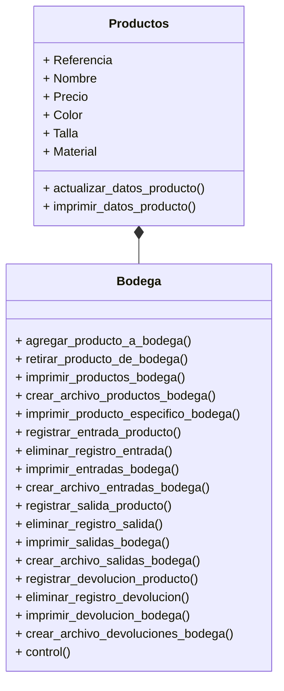

# NOTCLOTHES - Proyecto final POO
**Nombre del grupo:** );

**Integrantes:**
* Paula Jiménez Quiñones
* Jhon Alejandro Ramirez Diaz
* Sara Sofía Gómez Suárez

## Definición alternativa
### Alternativa 1
Construir una aplicación que emule un sistema de gestión de inventario para una bodega utilizando _Python_.

Condiciones:
+ Código original
+ Uso de herramientas vistas en el curso
+ Interacción y manejo a través de la consola
  
Operaciones:
+ Crear objeto a almacenar (+20 objetos, con distintos atributos)
+ Registro de entrada y salida
+ Método para obtener listado de inventario actual
+ Manejo de fechas en los registros
## Cómo se abordo el problema
### Sistema de gestión de inventario
En primer lugar, se hizo una investigación sobre el problema planteado. Este paso es muy importante para definir con claridad el problema y diseñar con mayor precisión los diagramas de clase.

Se investigó sobre lo que es una sistema de gestión de inventario y la forma en la que funciona. El entender este concepto del mundo real facilitó e hizo más eficiente el proceso de abstraer sus características principales, para luego representarlas gráficamente mediante clases, objetos y sus relaciones.


De acuerdo con Gabriel Baca (2014) en su libro _Introducción a la Ingenieria Industrial_, **el inventario** consiste en la acumulación de diversos artículos, materiales o productos que tienen valor y utilidad para una empresa. Estos materiales pueden ser utilizados como insumos (materias primas) para la producción de otros productos; también pueden ser productos intermedios (que están en proceso de transformación y serán trasladados a la siguiente etapa del proceso productivo), o productos terminados (que han completado el proceso productivo y están listos para ser enviados al cliente).

Sobre este contexto se entiende el **Sistema de Gestión de Inventario** como la acumulación y administración de artículos, materiales o productos que representan valor y utilidad para una empresa. El propósito de administrar el inventario de una empresa surge como forma de combatir la incertidumbre en la demanda y el suministro, asegurando que la empresa tenga los materiales necesarios para la producción y pueda satisfacer las necesidades de los clientes.

Por otro lado, el hecho de establecer un sistema de gestión de inventario implica algunos aspectos fundamentales como, el uso de **revisiones continuas**, reducción de niveles de inventario de seguridad, y métodos cuantitativos para equilibrar costos y niveles de servicio, asimismo formular un **conjunto de políticas y controles** que determinan las cantidades adecuadas de inventario, el tamaño de los pedidos y la frecuencia de compra y finalmente es importante mencionar que el hecho de mantener inventarios implica **riesgos** como obsolescencia, deterioro y costos de almacenamiento, de aqui la importancia de incluir costos de mantenimiento, pedidos y penalización.


### Empresa
En segundo lugar, se creó el escenario en el que se haría uso del sistema de gestión de inventario. Por lo tanto se ideó una empresa, se pensó en sus características principales y en el tipo de productos que vende.

Es así como creamos **NOTCLOTHES**.

En NotClothes, nos dedicamos a redefinir la alta costura y moda a través de un enfoque sostenible y centrado en el bienestar de nuestros clientes. Nuestro objetivo es crear prendas de diseño exclusivo y alta calidad en sus materiales que no solo realcen la belleza y la elegancia, sino que también promuevan la comodidad, las distintas perspectivas de género  y el respeto por el medio ambiente.

**MÉTRICAS** 

NOTCLOTHES, en su primer año de operaciones, generó ingresos por $4  millones USD, con un margen de beneficio bruto del 60% y una tasa de conversión del 3.5%. Con un valor promedio de pedido de $350 USD, ha capturado un 5% del mercado de alta costura sostenible en América Latina y mantiene una tasa de retención de clientes del 70%. **Su inventario rotativo** de 10,000 unidades tiene un ciclo de rotación de 90 días, y el coste de adquisición de clientes es de $50 USD. La tasa de devoluciones es del 5%, y cuenta con una comunidad activa de 500,000 seguidores en Instagram y 200,000 en TikTok. La base de clientes crece un 30% trimestre a trimestre, con un NPS de 85. Las ventas internacionales representan un 40% de los ingresos totales, NotClothes introduce 5 nuevos productos cada trimestre y ha reducido los costos operativos en un 20%. Las ventas online crecen un 40% año tras año, y participa en 10 eventos de moda anualmente. Su programa de fidelización tiene una participación del 50%, y ha reducido su huella de carbono en un 30% mediante el uso de materiales reciclados y procesos sostenibles.

### Productos
El tercer paso consistió en determinar cada uno de los productos que la empresa maneja y especificar sus atributos (nombre del producto, referencia, marca, precio, color, talla y material)

En la siguiente tabla se muestra el resultado de este paso.

||Producto|Ref.|Precio|Color|Talla|Material Principal|
|---|-----------------|------|---------|---------|--------|------|
|1|SKShirt|20-01|$200 USD|Negro|XS-S-M-L-XL-XL|Seda|
|2|MKShirt|20-02|$900 USD|Blanco|XS-S-M-L-XL-XL|Seda|
|3|NKShirt|20-03|$1200 USD|Gris|XS-S-M-L-XL-XL|Seda|
|4|RKShirt|20-04|$2200 USD|Beige|XS-S-M-L-XL-XL|Seda|
|5|PkShirt|20-05|$400 USD|Negro|XS-S-M-L-XL-XL|Seda|
|6|CargoPants|19-01|$100 USD|Negro|XS-S-M-L-XL-XL|Algodon|
|7|NCPants|19-02|$900 USD|Negro|XS-S-M-L-XL-XL|Algodon|
|8|WIDEPants|19-03|$400 USD|Negro|XS-S-M-L-XL-XL|Algodon|
|9|XASSPants|19-04|$400 USD|Negro|XS-S-M-L-XL-XL|Algodon|
|10|DadPants|19-05|$1200 USD|Negro|XS-S-M-L-XL-XL|Cuero|
|11|SMGSHOES|18-01|$200 USD|Negro|38-39-40-41|Cuero|
|12|HODSHOES|18-02|$500 USD|Negro|38-39-40-41|Cuero|
|13|TRACKTORSHOES|18-03|$3200 USD|Negro|38-39-40-41|Cuero|
|14|ADSHOES|18-04|$3200 USD|Negro|38-39-40-41|Cuero|
|15|NOTSHOES|18-05|$13.000 USD|Negro|UNICA|Cuero|
|16|CandyNECKLACE|17-01|$200 USD|Blanco|UNICA|Poliéster|Plata|
|17|BulletsNECKLACE|18-02|$100 USD|Gris|UNICA|Poliéster|Titanio|
|18|NONECK-LACE|18-03|$1000 USD|Plata|UNICA|Poliéster|Plata|
|19|MERCURYNECKLACE|18-04|$3200 USD|Negro|UNICA|Poliéster|Mercurio|
|20|SilverNecklace|18-05|$1200 USD|Plata|UNICA|Poliéster|Plata|

NOTCLOTHES maneja cinco líneas de productos con cinco tipos de referencias diferentes entre sí. 

### Diagramas de clase
Habiendo entendido la forma en la que funciona un sistema de gestión de inventario y habiendo definido el uso específico que se le va a dar a este en el proyecto, el cuarto paso consistió en modelar, mediante diagramas de clase, las clases, los objetos y sus relaciones.

**Relación bodega-productos**


### Código
Para finalizar, teniendo en cuenta los diagramas de clase creados anteriormente, se realizó el código en python que emula el sistema de gestión de inventario para una bodega de la empresa creada.

**Estructura**

```
estructura_archivos/
├── paquete/
│   ├── __init__.py
│   ├── bodega.py
└── main.py
```

**bodega.py**
```
import json
class Producto():
    def __init__(self, referencia:str, articulo:str, precio:float, color:str, talla: str, material:str):
        self.referencia=referencia
        self.articulo=articulo
        self.precio=precio
        self.color=color
        self.talla=talla
        self.material=material

    def actualizar_informacion_producto(self, nueva_referencia:str, nuevo_articulo:str, nuevo_precio:float, nuevo_color:str, nueva_talla:str, nuevo_material:str):
        self.referencia=nueva_referencia
        self.articulo=nuevo_articulo
        self.precio=nuevo_precio
        self.color=nuevo_color
        self.talla=nueva_talla
        self.material=nuevo_material
        print("La información del producto",self.articulo, "fue actualizada exitosamente.")

    def imprimir_informacion_producto(self):
        informacion_producto = {"REFERENCIA":self.referencia, "ARTÍCULO":self.articulo, "PRECIO":self.precio, "COLOR":self.color, "TALLA":self.talla, "MATERIAL": self.material}
        print("La información del producto", self.articulo, "es:")
        for k,v in informacion_producto.items():
            print(k,":", v)

class Bodega():
    def __init__(self, *args):#meter como atributos a los productos que estan en la bodega
        self.productos={}
        self.entradas={}
        self.salidas={}
        self.devolucion={}
        for x in range(len(args)):
            self.productos[args[x].referencia]={"ARTÍCULO":args[x].articulo, "PRECIO":args[x].precio,"ENTRADAS": 0, "SALIDAS": 0, "DEVOLUCIÓN":0, "STOCK":0}
    
    def agregar_producto_a_bodega(self, producto:Producto):
        if producto.referencia in self.productos:
            print("El producto",producto.articulo,"no se puede agregar a la bodega porque ya se encuentra registrado dentro del inventario de la bodega.")
        else:
            self.productos[producto.referencia]={"ARTÍCULO":producto.articulo, "PRECIO":producto.precio,"ENTRADAS": 0, "SALIDAS": 0, "DEVOLUCIÓN":0, "STOCK":0}
            print("El producto",producto.articulo,"fue agregado a bodega exitosamente.")

    def retirar_producto_de_bodega(self, producto:Producto):
        if producto.referencia in self.productos:
            del self.productos[producto.referencia]
            print("El producto",producto.articulo,"fue retirado de bodega exitosamente.")
        else:
            print("El producto",producto.articulo,"no se puede retirar de la bodega porque no se encuentra registrado dentro del inventario de la bodega.")

    def imprimir_productos_bodega(self):
        if len(self.productos)>0:
            print("La información de todos los productos que hay en el inventario de la bodega y el resumen de sus movimientos son: ")
            for k,v in self.productos.items():
                print(k,v)
        else:
            print("No hay ningún producto registrado en el inventario de la bodega.")
    
    def crear_archivo_productos_bodega(self):
        data=self.productos
        writeFile = open("data_productos_bodega.json","w")
        json.dump(data, writeFile)
        writeFile.close()
        print("El archivo de los productos en bodega fue creado exitosamente.")

    def imprimir_producto_especifico_bodega(self, producto:Producto):
        if producto.referencia in self.productos:
            print("La información del producto",producto.articulo,"y el resumen de sus movimientos son: ")
            print(producto.referencia, (self.productos[producto.referencia]))
        else:
            print("No se puede imprimir la información del producto",producto.articulo,"porque no se encuentra registrado dentro del inventario de la bodega.")

    def registrar_entrada_producto(self, referencia_producto_entrada: str, fecha_entrada:str, cantidad_producto_entrada:int):
        if referencia_producto_entrada in self.productos:
            longitud_diccionario=len(self.entradas)
            self.entradas[int(longitud_diccionario+1)]={"REFERENCIA":referencia_producto_entrada, "ARTÍCULO":self.productos.get(referencia_producto_entrada).get("ARTÍCULO"), "FECHA":fecha_entrada, "CANTIDAD":cantidad_producto_entrada}
            self.productos[referencia_producto_entrada]["ENTRADAS"]+=int(cantidad_producto_entrada)
            self.productos[referencia_producto_entrada]["STOCK"]+=int(cantidad_producto_entrada)
            print("La entrada del producto",self.productos.get(referencia_producto_entrada).get("ARTÍCULO"),"fue registrada exitosamente.")
        else:
            print("La entrada del producto no se puede registrar porque la referencia ingresada no existe en el inventario de la bodega.")
    
    def eliminar_registro_entrada(self,numero_de_registro_entrada:int):
        if numero_de_registro_entrada in self.entradas:
            self.productos[self.entradas[numero_de_registro_entrada]["REFERENCIA"]]["ENTRADAS"]-=int(self.entradas.get(numero_de_registro_entrada).get("CANTIDAD"))
            self.productos[self.entradas[numero_de_registro_entrada]["REFERENCIA"]]["STOCK"]-=int(self.entradas.get(numero_de_registro_entrada).get("CANTIDAD"))
            del self.entradas[numero_de_registro_entrada]
            print("La entrada con el número de registro ", numero_de_registro_entrada, "fue eliminada exitosamente.")
        else:
            print("No se puede eliminar la entrada con el número de registro", numero_de_registro_entrada, "porque no existe ese número de registro en el historial de entradas a la bodega.")

    def imprimir_entradas_bodega(self):
        if len(self.entradas)>0:
            print("El historial de todos los registros de las entradas a la bodega es: ")
            for k,v in self.entradas.items():
                print(k,v)
        else:
            print("Ninguna entrada a la bodega ha sido registrada.")

    def crear_archivo_entradas_bodega(self):
            data=self.entradas
            writeFile = open("data_entradas_bodega.json","w")
            json.dump(data, writeFile)
            writeFile.close()
            print("El archivo de las entradas a la bodega fue creado exitosamente.")

    def registrar_salida_producto(self, referencia_producto_salida: str, fecha_salida:str, cantidad_producto_salida:int):
        if referencia_producto_salida in self.productos:
            if cantidad_producto_salida<=self.productos.get(referencia_producto_salida).get("STOCK"):
                longitud_diccionario=len(self.salidas)
                self.salidas[int(longitud_diccionario+1)]={"REFERENCIA":referencia_producto_salida, "ARTÍCULO":self.productos.get(referencia_producto_salida).get("ARTÍCULO"), "FECHA":fecha_salida, "CANTIDAD":cantidad_producto_salida}
                self.productos[referencia_producto_salida]["SALIDAS"]+=int(cantidad_producto_salida)
                self.productos[referencia_producto_salida]["STOCK"]-=int(cantidad_producto_salida)
                print("La salida del producto",self.productos.get(referencia_producto_salida).get("ARTÍCULO"),"fue registrada exitosamente.")
            else:
                print("La salida del producto",self.productos.get(referencia_producto_salida).get("ARTÍCULO"),"no se puede registrar porque no hay suficientes unidades del producto en el stock.")
        else:
            print("La salida del producto no se puede registrar porque la referencia ingresada no existe en el inventario de la bodega.")

    def eliminar_registro_salida(self,numero_de_registro_salida:int):
        if numero_de_registro_salida in self.salidas:
            self.productos[self.salidas[numero_de_registro_salida]["REFERENCIA"]]["SALIDAS"]-=int(self.salidas.get(numero_de_registro_salida).get("CANTIDAD"))
            self.productos[self.salidas[numero_de_registro_salida]["REFERENCIA"]]["STOCK"]+=int(self.salidas.get(numero_de_registro_salida).get("CANTIDAD"))
            del self.salidas[numero_de_registro_salida]
            print("La salida con el número de registro ", numero_de_registro_salida, "fue eliminada exitosamente.")
        else:
            print("No se puede eliminar la salida con el número de registro", numero_de_registro_salida, "porque no existe ese número de registro en el historial de salidas de la bodega.")

    def imprimir_salidas_bodega(self):
        if len(self.salidas)>0:
            print("El historial de todos los registros de las salidas de la bodega es:")
            for k, v in self.salidas.items():
                print(k,v)
        else:
            print("Ninguna salida de la bodega ha sido registrada.")

    def crear_archivo_salidas_bodega(self):
            data=self.salidas
            writeFile = open("data_salidas_bodega.json","w")
            json.dump(data, writeFile)
            writeFile.close()
            print("El archivo de las salidas de la bodega fue creado exitosamente.")

    def registrar_devolucion_producto(self, referencia_producto_devolucion: str, fecha_devolucion:str, cantidad_producto_devolucion:int):
        if referencia_producto_devolucion in self.productos:
            if cantidad_producto_devolucion<=self.productos.get(referencia_producto_devolucion).get("SALIDAS"):
                longitud_diccionario=len(self.devolucion)
                self.devolucion[int(longitud_diccionario+1)]={"REFERENCIA":referencia_producto_devolucion, "ARTÍCULO":self.productos.get(referencia_producto_devolucion).get("ARTÍCULO"), "FECHA":fecha_devolucion, "CANTIDAD":cantidad_producto_devolucion}
                self.productos[referencia_producto_devolucion]["DEVOLUCIÓN"]+=int(cantidad_producto_devolucion)
                self.productos[referencia_producto_devolucion]["STOCK"]+=int(cantidad_producto_devolucion)
                print("La devolución del producto",self.productos.get(referencia_producto_devolucion).get("ARTÍCULO"),"fue registrada exitosamente.")
            else: 
                print("La salida del producto", self.productos.get(referencia_producto_devolucion).get("ARTÍCULO"), "no se puede registrar porque la cantidad de devolución no puede ser mayor a la cantidad de salidas del producto.")
        else:
            print("La devolución del producto no se puede registrar porque la referencia ingresada no existe en el inventario de la bodega.")
    
    def eliminar_registro_devolucion(self,numero_de_registro_devolucion:int):
        if numero_de_registro_devolucion in self.devolucion:
            self.productos[self.entradas[numero_de_registro_devolucion]["REFERENCIA"]]["DEVOLUCIÓN"]-=int(self.devolucion.get(numero_de_registro_devolucion).get("CANTIDAD"))
            self.productos[self.devolucion[numero_de_registro_devolucion]["REFERENCIA"]]["STOCK"]-=int(self.devolucion.get(numero_de_registro_devolucion).get("CANTIDAD"))
            del self.devolucion[numero_de_registro_devolucion]
            print("La devolución con el número de registro ", numero_de_registro_devolucion, "fue eliminada exitosamente.")
        else:
            print("No se puede eliminar la devolución con el número de registro", numero_de_registro_devolucion, "porque no existe ese número de registro en el historial de devoluciones de la bodega.")
    
    def imprimir_devoluciones_bodega(self):
        if len(self.devolucion)>0:
            print("El historial de todos los registros de las devoluciones de la bodega es:")
            for k,v in self.devolucion.items():
                print(k,v)
        else:
            print("Ninguna devolución ha sido registrada.")

    def crear_archivo_devoluciones_bodega(self):
            data=self.devolucion
            writeFile = open("data_devoluciones_bodega.json","w")
            json.dump(data, writeFile)
            writeFile.close()
            print("El archivo de las devoluciones de la bodega fue creado exitosamente.")

    def control(self):#Método para hacer conteo del inventario y confirmar que los datos del sistema sean iguales a los del conteo
        control_correcto={}
        control_incorrecto={}
        tipo_control=int(input("Usted va a realizar el control extracontable. Si el control es del todo el inventario ingrese el número 1, si es de solo un producto ingrese el número 2: "))
        if tipo_control==1:
            for x in self.productos:
                cantidad=int(input("Digite la cantidad de "+ str(x)+ " : "+str(self.productos.get(x).get("ARTÍCULO"))+" que hay en la bodega: "))
                if cantidad==int(self.productos.get(x).get("STOCK")):
                    control_correcto[x]={"ARTÍCULO":self.productos.get(x).get("ARTÍCULO"),"CANTIDAD":self.productos.get(x).get("STOCK")}
                    print("Los datos ingresados SÍ coinciden con los datos del sistema.")
                else:
                    control_incorrecto[x]={"ARTÍCULO":self.productos.get(x).get("ARTÍCULO"),"CANTIDAD EN EL PROGRAMA":self.productos.get(x).get("STOCK"), "CANTIDAD DEL CONTEO":cantidad}
                    print("Los datos ingresados NO coinciden con los datos del sistema. ")
            if len(control_correcto)>0:
                print("Los productos en los que SÍ coincide la cantidad en el sistema y en el conteo son: ")
                for k, v in control_correcto.items():
                    print(k,v)
            if len(control_incorrecto)>0:
                print("Los productos en los que NO coincide la cantidad en el sistema y en el conteo son: ")
                for k,v in control_incorrecto.items():
                    print(k,v)
        elif tipo_control==2:
            producto_control=str(input("Ingrese la referencia del producto del cual desea hacer el control: "))
            if producto_control in self.productos:
                cantidad=int(input("Digite la cantidad de "+ producto_control + " : "+str(self.productos.get(producto_control).get("ARTÍCULO"))+" que hay en la bodega: "))
                if cantidad==int(self.productos.get(producto_control).get("STOCK")):
                    print("Los datos ingresados SÍ coinciden con los datos del sistema.")
                else:
                    print("Los datos ingresados NO coinciden con los datos del sistema. ")
                    control_incorrecto[producto_control]={"ARTÍCULO":self.productos.get(producto_control).get("ARTÍCULO"),"CANTIDAD EN EL PROGRAMA":self.productos.get(producto_control).get("STOCK"), "CANTIDAD DEL CONTEO":cantidad}
                    for k,v in control_incorrecto.items():
                        print(k,v)
            else:
                print("La referencia ingresada no existe en el inventario de la bodega.")
        else:
            print("El número ingresado no es válido.")

        print("El control ha finalizado.")
```
**main.py**
```
import paquete.bodega as bodega

def main():
    shirt=bodega.Producto("20-01", "SHIRT", 200, "negro","xs-s-m-l-xl", "algodón")
    pants=bodega.Producto("20-02", "PANTS", 900, "negro","xs-s-m-l-xl", "algodón")
    dress=bodega.Producto("20-03", "DRESS", 1200, "negro","xs-s-m-l-xl", "algodón")
    jacket=bodega.Producto("20-04", "JACKET", 2200, "negro","xs-s-m-l-xl", "cuero")
    skirt=bodega.Producto("20-05", "SKIRT", 400, "negro","xs-s-m-l-xl", "algodón")
    shorts=bodega.Producto("20-06", "SHORTS", 100, "negro","xs-s-m-l-xl", "algodón")
    sweater=bodega.Producto("20-07", "SWEATER", 900, "negro","xs-s-m-l-xl", "algodón")
    blouse=bodega.Producto("20-08", "BLOUSE", 400, "negro","xs-s-m-l-xl", "algodón")
    tshirt=bodega.Producto("20-09", "T-SHIRT", 400, "negro","xs-s-m-l-xl", "algodón")
    coat=bodega.Producto("20-10","COAT",1200, "negro","xs-s-m-l-xl", "cuero")
    jeans=bodega.Producto("20-11", "JEANS", 200, "negro","xs-s-m-l-xl", "algodón")
    hoodie=bodega.Producto("20-12", "HOODIE", 500, "negro","xs-s-m-l-xl", "algodón")
    suit=bodega.Producto("20-13", "SUIT", 3200, "negro","xs-s-m-l-xl", "algodón")
    tracksuit=bodega.Producto("20-14", "TRACKSUIT", 3200, "negro","xs-s-m-l-xl", "nylon")
    sportswear=bodega.Producto("20-15", "SPORTSWEAR", 200, "negro","xs-s-m-l-xl", "algodón")
    footwear=bodega.Producto("20-16","FOOTWEAR",4200, "negro","6-8", "poliéster")
    underwear=bodega.Producto("20-17", "UNDERWEAR", 100, "negro","única", "poliéster")
    bag=bodega.Producto("20-18", "BAG", 1000, "negro","única", "poliéster")
    jewelry=bodega.Producto("20-19", "JEWELRY", 3200, "negro","única", "poliéster")
    hat=bodega.Producto("20-20", "HAT", 1200, "negro","única", "poliéster")

    inventario_bodega=bodega.Bodega(shirt,pants,dress,jacket,skirt,shorts,sweater,blouse,tshirt,coat,jeans,hoodie,suit,tracksuit,sportswear,footwear,underwear,bag,jewelry,hat)

    inventario_bodega.registrar_entrada_producto("20-01", "01/09/2024", 15000)
    inventario_bodega.registrar_entrada_producto("20-03", "01/09/2024", 25000)
    inventario_bodega.registrar_entrada_producto("20-05", "01/09/2024", 5000)
    inventario_bodega.registrar_entrada_producto("20-04", "01/09/2024", 1000)
    inventario_bodega.registrar_entrada_producto("20-01", "01/09/2024", 10000)
    inventario_bodega.registrar_entrada_producto("20-02", "01/09/2024", 20000)
    inventario_bodega.registrar_entrada_producto("20-12", "01/09/2024", 30000)
    inventario_bodega.registrar_entrada_producto("20-13", "01/09/2024", 3000)
    inventario_bodega.registrar_entrada_producto("20-15", "01/09/2024", 2000)
    inventario_bodega.registrar_entrada_producto("20-16", "01/09/2024", 500)
    inventario_bodega.registrar_entrada_producto("20-19", "01/09/2024", 100)
    inventario_bodega.registrar_entrada_producto("20-20", "01/09/2024", 15000)
    inventario_bodega.registrar_entrada_producto("20-19", "01/09/2024", 25000)
    inventario_bodega.registrar_entrada_producto("20-03", "01/09/2024", 100)

    inventario_bodega.registrar_salida_producto("20-01", "01/09/2024", 1100)
    inventario_bodega.registrar_salida_producto("20-03", "01/09/2024", 1000)
    inventario_bodega.registrar_salida_producto("20-19", "01/09/2024", 1500)
    inventario_bodega.registrar_salida_producto("20-15", "01/09/2024", 500)
    inventario_bodega.registrar_salida_producto("20-13", "01/09/2024", 500)
    inventario_bodega.registrar_salida_producto("20-12", "01/09/2024", 600)
    inventario_bodega.registrar_salida_producto("20-02", "01/09/2024", 1000)
    inventario_bodega.registrar_salida_producto("20-04", "01/09/2024", 150)
    inventario_bodega.registrar_salida_producto("20-01", "01/09/2024", 110)
    inventario_bodega.registrar_salida_producto("20-20", "01/09/2024", 1000)

    inventario_bodega.registrar_devolucion_producto("20-02", "01/09/2024", 200)

    inventario_bodega.imprimir_productos_bodega()
    inventario_bodega.imprimir_entradas_bodega()
    inventario_bodega.imprimir_salidas_bodega()
    inventario_bodega.imprimir_devoluciones_bodega()
    inventario_bodega.control()
if __name__=="__main__":
    main()
```
## Solución y la explicación
## Cómo instalar y usar el desarrollo
## Requerimientos para crear un entorno virtual
## Conclusiones
**Conclusión del Proyecto de Gestión de Inventario en Python**

En el desarrollo de este proyecto, hemos adquirido conocimientos fundamentales sobre la **gestión de inventarios** y su implementación práctica mediante el uso de la programación orientada a objetos. La investigación inicial nos permitió comprender la importancia de un sistema de gestión de inventarios, el cual es esencial para cualquier empresa que maneje productos físicos. Este conocimiento teórico fue la base para la creación de una aplicación que emula un sistema de gestión de inventarios, permitiéndonos aplicar conceptos de programación orientada a objetos, diseño de clases y manejo de datos.

La elaboración de este proyecto ha sido crucial desde el campo de la **ingeniería industrial**. La gestión eficiente de inventarios es un pilar en la optimización de recursos y la reducción de costos operativos. Al desarrollar una bodega en Python, hemos podido simular y analizar diferentes escenarios de entrada, salida y devolución de productos, lo que nos ha permitido entender mejor los flujos de materiales y la importancia de mantener un control riguroso sobre el inventario. Este ejercicio práctico nos ha brindado una visión más amplia, profunda y sobbretodo contextual de cómo los sistemas de información y tecnológicos son esenciales y pueden integrarse en los procesos industriales para mejorar la toma de decisiones y la eficiencia operativa.

Además, la implementación de este sistema nos ha permitido explorar y aplicar **métodos cuantitativos** para equilibrar costos y niveles de servicio, así como formular políticas y controles que determinan las cantidades adecuadas de inventario, el tamaño de los pedidos y la frecuencia de compra. Estos aspectos son fundamentales en la **Ingeniería Industrial**, ya que contribuyen a la **reducción de riesgos** como la obsolescencia, el deterioro y los costos de almacenamiento.

En terminos generales, la creación de una bodega en Python no solo ha fortalecido nuestras habilidades técnicas en programación y diseño de sistemas, sino que también ha enriquecido nuestro entendimiento de los principios de la Ingeniería Industrial. Este proyecto nos ha demostrado cómo la programacion orientada a objetos es una herramienta poderosa para optimizar procesos y mejorar la gestión de recursos en un entorno empresarial.

## Bibliografía
Baca Urbina, G., Cruz Valderrama, M., Cristóbal Vázquez, M. A., Baca Cruz, G., Gutiérrez Matus, J. C., Pacheco Espejel, A. A., Rivera González, Á. E., Rivera González, I. A., & Obregón Sánchez, M. G. (2014)Introducción a la Ingeniería Industrial (2ª ed.)1. Grupo Editorial Patria. ISBN 978-607-438-919-72.
